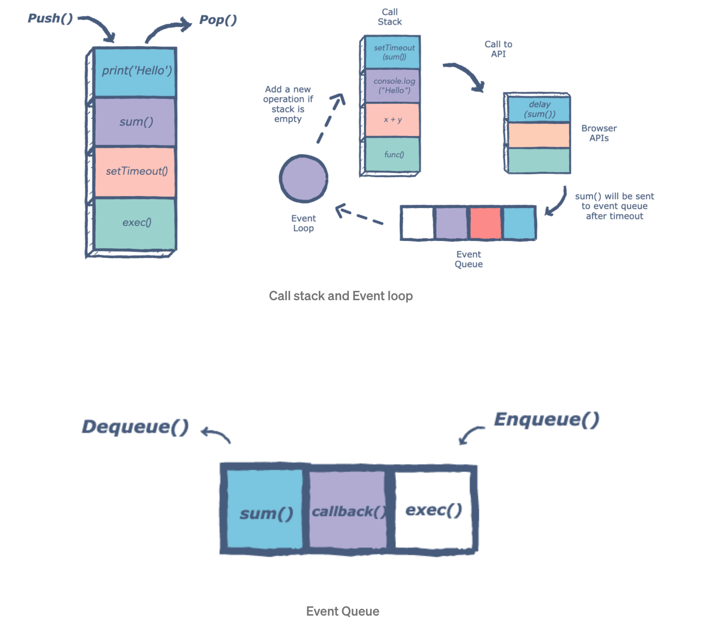

# 401 JS Prep readings

The article [How to Solve Programming Problems by John Sonmez](https://simpleprogrammer.com/solving-problems-breaking-it-down/)

Key take aways:
- Allocate time wisely 
    - don't jump directly into code
    - take the time to understand the problem statement
- Don't over solve on the first iteration

The author recommends 6 steps:
1.  Read the problem completely twice.
2.  Solve the problem manually with 3 sets of sample data.
3.  Optimize the manual steps.
4.  Write the manual steps as comments or pseudo-code.
5.  Replace the comments or pseudo-code with real code.
6.  Optimize the real code.

with as much as 70% of the allotted time spent on 1-3

___________________________

Act like you make $1000/hr posted link is broken

________________________

The article [How to think like a programmer — lessons in problem solving by Richard Reis](https://www.freecodecamp.org/news/how-to-think-like-a-programmer-lessons-in-problem-solving-d1d8bf1de7d2)

Key take aways:
- Most people problem solve with trial and error
   
- Better: have a framework and practice it (!!)
    - this is evident in CF if/when you get used to using the whiteboard method

The author recommends 4 steps:
1.  Understand
    - know what's being asked and be able to describe it in plain language
2.  Plan
    - in the author's words, planning starts with “Given input X, what are the steps necessary to return output Y?”
3.  Divide
    - identify and solve sub-problems first, then connect the dots
4.  Stuck?
    - 3 ways to get unstuck acc to the author: debug, reassess/take a step back, research

_______________________

The article [5 Whys
Getting to the Root of a Problem Quickly](https://www.mindtools.com/pages/article/newTMC_5W.htm)

Key take aways:
- Acc to the author, "Sakichi Toyoda, the Japanese industrialist, inventor, and founder of Toyota Industries, developed the 5 Whys technique in the 1930s. It became popular in the 1970s, and Toyota still uses it to solve problems today." 
- The 5 Whys are a great start to root cause analysis 
   
- Can be used for troubleshooting or quality improvement on simple to moderately complex problems

The author recommends how to use the 5 Whys :
1.  Find your team including a facilitator
2.  Define the Problem
3.  Ask the first, high-level Why (is the problem occurring)
4.  Drill down into finer details/solutions asking narrowing Whys 4 more times
5.  Know when to stop...more whys don't yield better solutions
6. Identify root cause(s)/counter-measures to prevent recurrence after solutions have been implemented
7.  Monitor your counter-measures

__________________________

The YouTube: [What the heck is the event loop anyway? | Philip Roberts | JSConf EU](https://www.youtube.com/watch?v=8aGhZQkoFbQ)

Key take aways:
- JS is described by the speaker as "a single threaded single concurrent language ... with a call stack, an event loop, a callback queue, and some other APIs and stuff."

Frankly, I got next to nothing out of this talk, so I went digging for my own source.

This article is much clearer with some excellent visual representations: [The JavaScript Event Loop: Explained by Ayush Verma](https://towardsdev.com/event-loop-in-javascript-672c07618dc9)
- It's important to understand the asynchronous behavior is not inherent in JS language, but rather laid ontop by the browser/programming environment and the API calls
   
- Acc to the author, the event loop portion is simple:

`"There’s an endless loop, where the JavaScript engine waits for tasks, executes them, and then sleeps, waiting for more tasks."`

Examples of tasks are:
1. When an external script ```<script src="...">``` loads, the task is to execute it.

2. When a user moves their mouse, the task is to dispatch mousemove event and execute handlers.
3. When the time is due for a scheduled setTimeout, the task is to run its callback.

4.  ... etc

This article has a wealth of detailed information, and the following diagrams are very helpful




_________________

YouTube: [The Super Mario Effect - Tricking Your Brain into Learning More | Mark Rober | TEDxPenn](https://www.youtube.com/watch?v=9vJRopau0g0)

- The author looks at how to re-frame the learning process

- The author's simple study  proposes that students who are not concerned about failure will try and learn more

- He compares it to the fearless toddler

- Students should be focusing on the goal (saving the Mario Princess) and not the obstacles (the pitfalls)

- Frame a challenge in a way in which you want to keep trying vs making it a competition against obstacles

- The author frames learning through a "gamification" of tasks to invoke the feeling of risk/reward satisfaction similiar to beating a video game