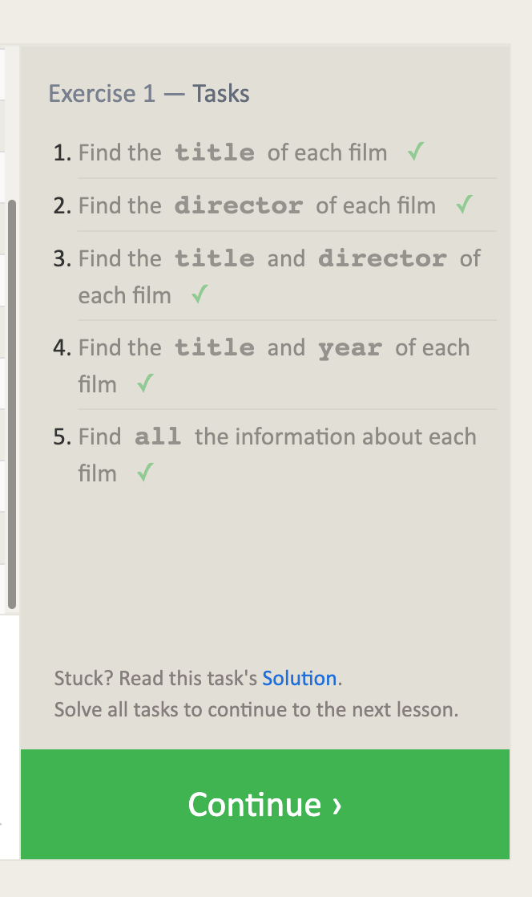

# SQL tutorials

these are good tutorials for basics: [SQL Bolt](https://sqlbolt.com/lesson/select_queries_with_constraints)

I've hated SQL each time I've tried to use it in a CF course.  The only exception was an easy use of ElephantSQL in Python 401.

### Lesson 1:  
the format of basic SQL queries is self explanatory.  Remember that * is all and format is column, column

### Lesson2: 

### Lesson 3:  

### Lesson 4:  

### Lesson 5:  

### Lesson 6:  

### Lesson 13:  

### Lesson 14:  

### Lesson 15:  

### Lesson 16:  

### Lesson 17:  

### Lesson 18:  

NOTE: I was able to start on the tutorials but am dead in the water for any real SQL work because my SQL installation is having problems!!

