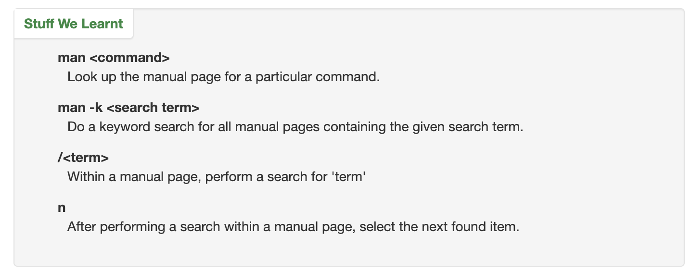

# Terminal Practice

https://ryanstutorials.net/linuxtutorial/

The Command Line - What is it, how does it work and how do I get to one.

- I really struggled with the CLI when I started CF.  I definitely fell into the category of a Mac user that didn't really understand what was going on under the hood.  I'm conditioned to use easy shortcuts like arrow keys for history (as the author describes), but I had fully intended to create more aliases, scripts, etc to make my workflow more efficient.....still undone

Basic Navigation - An introduction to the Linux directory system and how to get around it.

- I'm pretty comfortable with basic navigation including cd, pwd, .., etc.  I understand relative and absolute paths (VS Code folder structure also cements this notion as I tend to put a lot of links to other files, image links, etc into reading notes, READMEs, and other docs)

More About Files - Find out some interesting characteristics of files and directories in a Linux environment.

- I'm comfortable navigating file structure, using ls -a to see the list in a folder, etc.  I've conditioned myself to use prescripted file naming conventions in much of my digital work because I ran into a lot of problems with spaces, capitalization, etc starting in 102. I often get files sent from clients and need to rename them, but it's handy to know I can use quotes or an escape to search for filenames with spaces.

Manual Pages - Learn how to make the most of the Linux commands you are learning.

- I love using the manual pages, but often can't remember they syntax to use them.  I'll keep this list handy

 

File Manipulation - How to make, remove, rename, copy and move files and directories.

- I should focus on getting better at using the CLI for file manipulation during this round of 401.  I get frustrated trying to remember the syntax and often find myself resorting to the GUI to drag and drop--especially images needed for a project.  MY workflow is quicker using the GUI, but I understand that's not the prefered way to do it.

Cheat Sheet - A quick reference for the main points covered in this tutorial. 

- This cheat sheet is pretty good.  I've also started diving into a pocket guide for terminal CLI Linux and have my own notebook devoted to commands and shortcuts I use regularly.  Stillllllll need to create those aliases and scripts.  Maybe this class??