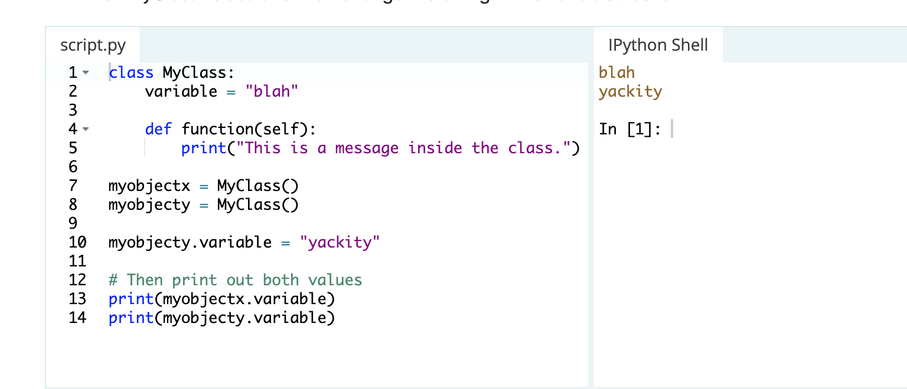

## Classes and Objects
notes from [this article](https://www.learnpython.org/en/Classes_and_Objects)

Objects are an encapsulation of variables and functions into a single entity. Objects get their variables and functions from classes. Classes are essentially a template to create your objects.

Make a Class (1-5), assign two Objects to the class (7-8) and access the variables in the Class (13-14)

To access a function inside of an object you use notation similar to accessing a variable: `myobjectx.function()`