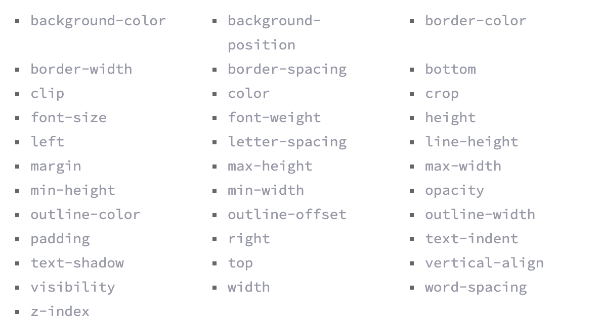

## CSS Animation:
These articles 

[transforms](https://learn.shayhowe.com/advanced-html-css/css-transforms/) : 2D and 3D

```
div {
  -webkit-transform: scale(1.5);
     -moz-transform: scale(1.5);
       -o-transform: scale(1.5);
          transform: scale(1.5);
}
```
- Can scale X, Y, both `scale(x,y)`

- The rotate value provides the ability to rotate an element from 0 to 360 degrees. Using a positive value will rotate an element clockwise, and using a negative value will rotate the element counterclockwise. The default point of rotation is the center of the element, 50% 50%, both horizontally and vertically. Later we will discuss how you can change this default point of rotation. `transform: rotate(0-360)`

- `transform: translate(x,y)` The distance values used within the translate value may be any general length measurement, most commonly pixels or percentages.

- `transform: skew (x,y)` in degrees

- COMBINING syntax `transform: rotate(25deg) scale(.75);`

- You can change the origin of the transform:
```
.box-1 {
  transform: rotate(15deg);
  transform-origin: 0 0;
}
.box-2 {
  transform: scale(.5);
  transform-origin: 100% 100%;
}
.box-3 {
  transform: skewX(20deg);
  transform-origin: top left;
}
.box-4 {
  transform: scale(.75) translate(-10px, -10px);
  transform-origin: 20px 50px;
}
```
- Perspective: Imagine yourself standing 10 feet away from a 10 foot cube as compared to standing 1,000 feet away from the same cube. At 10 feet, your distance to the cube is the same as the dimensions of the cube, therefore the perspective shift is much greater than it will be at 1,000 feet, where the dimensions of the cube are only one one-hundredth of your distance to the cube. The same thinking applies to perspective depth values.

```
.box-1 {
  transform: perspective(100px) rotateX(45deg);
}
.box-2 {
  transform: perspective(1000px) rotateX(45deg);
}
```

- Check the article on 3D tricks

[transitions and animations](https://learn.shayhowe.com/advanced-html-css/transitions-animations/): 

- There are four transition related properties in total, including transition-property, transition-duration, transition-timing-function, and transition-delay. 

- Transition property:
```
.box {
    background: #2db34a;
    border-radius: 6px
    transition-property: background, border-radius;
    transition-duration: 1s;
    transition-timing-function: linear;
  }
  .box:hover {
    background: #ff7b29;
    border-radius: 50%;
  }
```
- Not all can be transitioned if the property doesn't have a mid-point.  Here are some common properties that can be transitioned:



- CHECK OUT THE CARD FLIP CODE
- CHECK OUT THE KEYFRAMES CODE FOR SLIDE, ETC

[8 SIMPLE TRANSTIONS](https://www.webdesignerdepot.com/2014/05/8-simple-css3-transitions-that-will-wow-your-users/)

- Fade in, change color, grow and shrink, rotate, square to circle, 3D shadow, swing, inset border

[Animated buttons CoePen demo](https://codepen.io/retyui/pen/ByoaXV)

[Keyframes on CodePen](https://codepen.io/akshaychauhan/pen/oAfae)

[CodePen animated 404](https://codepen.io/kieranfivestars/pen/MYdQxX)

[CodePen bounce demo](https://codepen.io/dp_lewis/pen/gCfBv)

