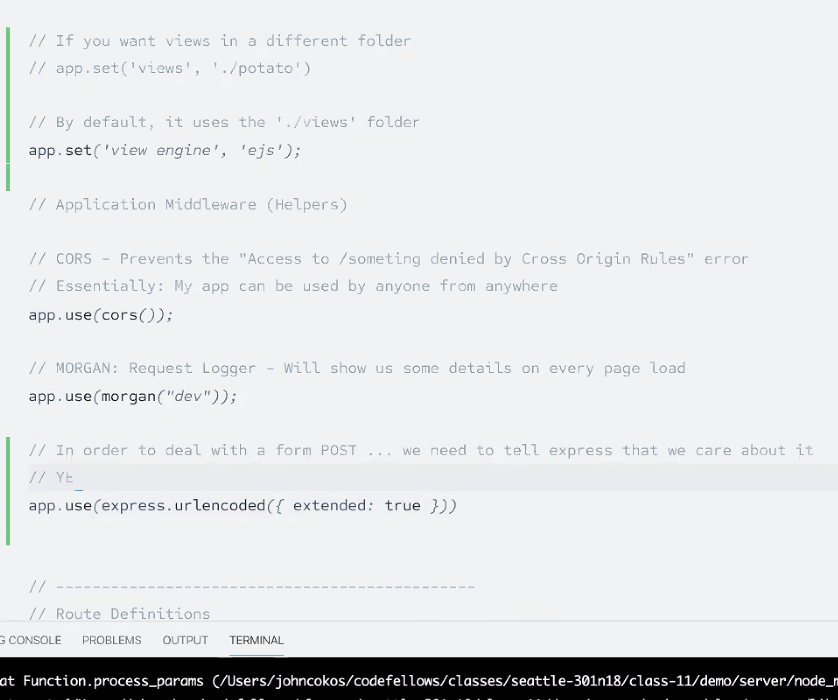

## Embedded JS (EJS)

A templating mechanism/language that that lets you generate HTML markup with plain JavaScript

A dependency that must be installed in Node using `npm install ejs` 

and 

`ejs = require('ejs)`

Uses "strawberries" `%>...<%`

Uses = to print to screen
```
<% if (user) { %>
  <h2><%= user.name %></h2>
<% } %>
```

Other **Tags**

```
<% 'Scriptlet' tag, for control-flow, no output

<%_ ‘Whitespace Slurping’ Scriptlet tag, strips all whitespace before it

<%= Outputs the value into the template (HTML escaped)

<%- Outputs the unescaped value into the template

<%# Comment tag, no execution, no output

<%% Outputs a literal '<%'

%> Plain ending tag

-%> Trim-mode ('newline slurp') tag, trims following newline

_%> ‘Whitespace Slurping’ ending tag, removes all whitespace after it
```

Review the YouTube tutorial [here](https://www.youtube.com/playlist?list=PL7sCSgsRZ-slYARh3YJIqPGZqtGVqZRGt)


[EJS documentation](https://ejs.co/)

- Make sure to insert the middleware code so you can use the Express with POST method:




- Take a look at Express docs to make use of render in conjunction with the EJS templates:

[EJS render documentation](https://expressjs.com/en/api.html#res.render)

