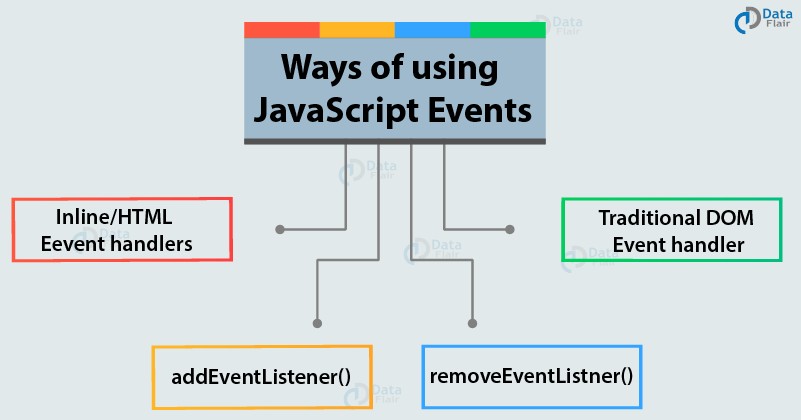

## Events pp 243-292

+ interactions create events

+ events trigger code

+ code responds to user

+  Event= browser's way of indicating when something has happened (eg: page loaded, button clicked)

+ Binding states which even you are waiting to happen and the element upon which the event will occur

+ Uses JS functions to make the page feel interactive and responsive to the user

+ Use delegation for event to happen on all children

+ Most common are W3C DOM events

## REVIEW this chapter!!