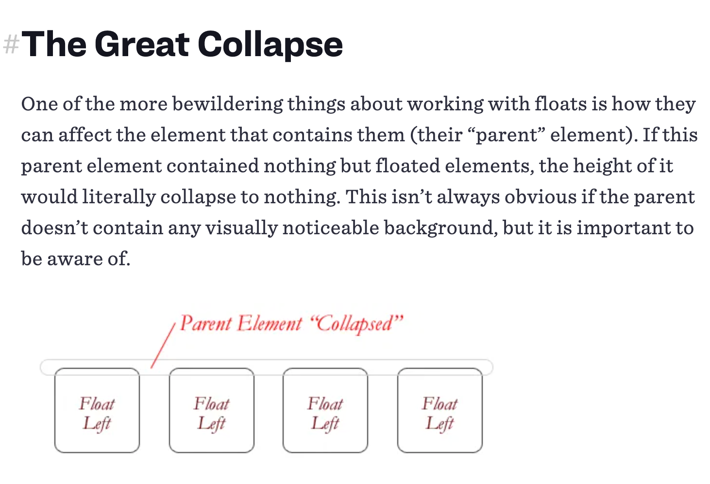

## Floats

[this article](https://css-tricks.com/all-about-floats/)

Floats help with a fluid layout and getting away from the boxy grid structures of past websites.

Mirrors print design in text wrapping around images and avoids other layout constraints or the use of workarounds (such as negative margins)

`float: left, right, none, or inherent`

undone with
+ `clear:`

+ empty `
`

+ parent set to `overflow: auto or hidden`

Remember:

Check th article for concerns with/workarounds for older browsers