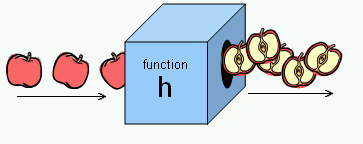

## Functions see 86-99
+ group a series of statements together to perform a **specific** task
+ just enough code for that one thing
+ some need pieces of info called **parameters**
+ when you write a fn that gives a response that's a **return value**
+ return statement is not always needed
+ declaration using keyword: function.name() {stuff to do}
    - may have parameters
+ called with name(); parameters in the () as needed
+ **always start with lower case**
+ test in console log
+ can return single value (calculation) or multiple values (via array)
+ use function declaration for **named functions**

    - `function area (width, height)`
+ use function expression to call **anonymous function**
    - ` var area = function (width, height`)

+ immediately invoked function expressions (iify)
    - executed once interpreter reads
    - variable area holds the function return value
         ```
        var area =(function(){
            var width = 3;
            var height = 2;
            return width * height;
        }()) 
        //parenthesis pair ensures iffy
        //enclosing paren make it an expression
        ```
+ remember **local** vs **global** variables
    - local declared within a function and only accessible by that function

    - global outside function and anywhere within the script gives access to the script

    - global stored in memory (for as long as page is loaded) vs local used and discarded:  use local whenever possible

    - local can change value each time fn runs

    - different fun can use same name localvar without conflict


