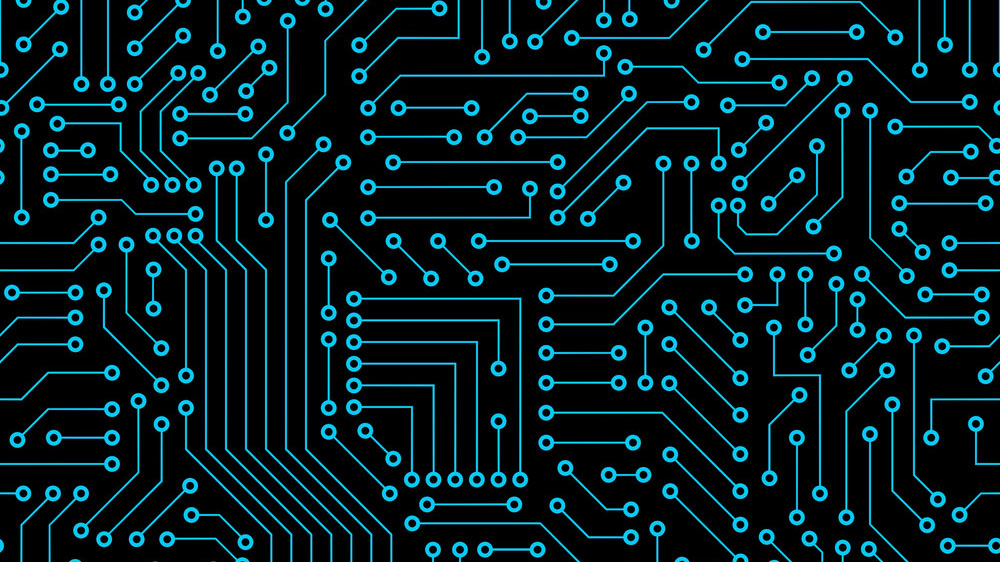

# Computer Architecture and Logic

**All computers are built to do 4 things:**
+ Take input from the real world
+ Store that input
+ Process that input in some way
+ Return an output

How each computer does these four things depends on it's capacity (hardware) and how it is programmed to process the info (software)

Every computer is made up of logical circuits that do something with the original input and either return a result immediately or pass it on to other circuits to further process.  For example, the most basic logic is True vs False.  A simple single wire circuit is on (True) or off (False).  If you add just one more wire, it can calculate things like AND (both wires on) and OR (at least one wire on) logic.  Those logical outputs are used by other circuits to formulate the output as programmed by the software.

Inputs could be anything from a keyboard stroke to a finger on a touchscreen to a controller click on an XBox.

Output devices include a display screen, a printer, a motion of a robotic arm, etc

The processing in between input and output is "the magic" that is transparent to the user

Computers think in 1s (on/true) and 0s (off/false) but modern day input software and computer languages turn user actions or language programming into 1s and 0s for the user/programmer.  

My first course in Computer Science was Maching Language--typing in code that was strictly 1s and 0s to communicate directly with the computer circuitry logic, but that's not very useful as inputs and outputs and processing steps get more complicated