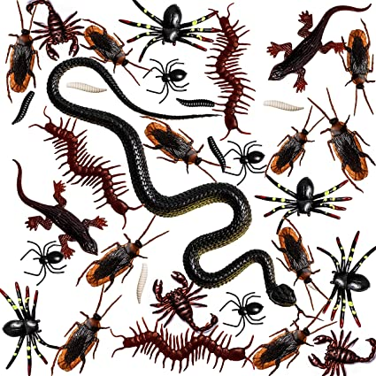

## Debugging (pp 449-486)

+ Uses the process of deduction

+ Console logging is helpful for methodical approach

+ Know the order of script execution

+ Know the execution context: global or function

+ Understand how the stack works:

