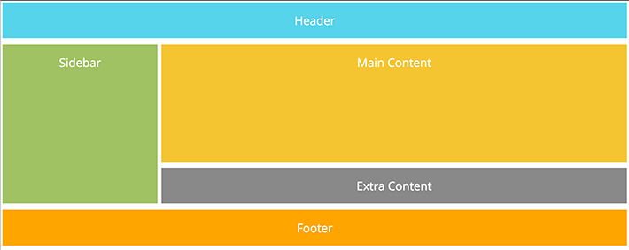

### *Updated for Class 8

Can display block
    - `<h1>, 
, <ul>, <li>`

Can display inline
    - `<image>, <b>, <i>`

Block w/block inside is **containing** or **parent**

Positioning:
+ use normal flow (default) blocks
    - `position: static`
+ use relative positioning to shift (top, rt, bottom, lft)
    - `positon: relative`
+ use fixed absolute in relation to browser window vs other elements
    - `position: absolute` or `position: absolute`
+ float/flex: remove from normal flow and position far left or far right with other elements flowing around
    - `float` or  `display: flex`
+ remember `z-index` to position box on top
+ side-by-side using column defs or css
+ float with `class="clear"` left, right, both, none leaves space between boxes (p 372)
+ `overflow` and `width` in css fix problem of some browsers treating floated elements as zero px tall (thus collapsing box boarders if box contains only floated objects)

____________________
+ **NEW** build columns using floats

____________________

Look at pp. 387-394 for familiar 112-column grid layout

Remember fixed and liquid layouts--especially for responsive css

Modular CSS: stylesheet with layout and another with fonts, colors, etc (like blueprint.css)
+ use ` @import url ("xx.css");` at top of main CSS stylesheet to link to others

+ use multiple `<link>` on HTML ot link multiple stylesheets (keep in mind precedence)

### Screen sizes--for responsive
+ Phone: (960 x ) 640px
+ iPad: (1024 x ) 768px
+ 13":  (1280 x ) 800px
+ desktop: (2560 x) 1440px (default)

+ () for scroll concerns

**responsive css via media query at xx size**
