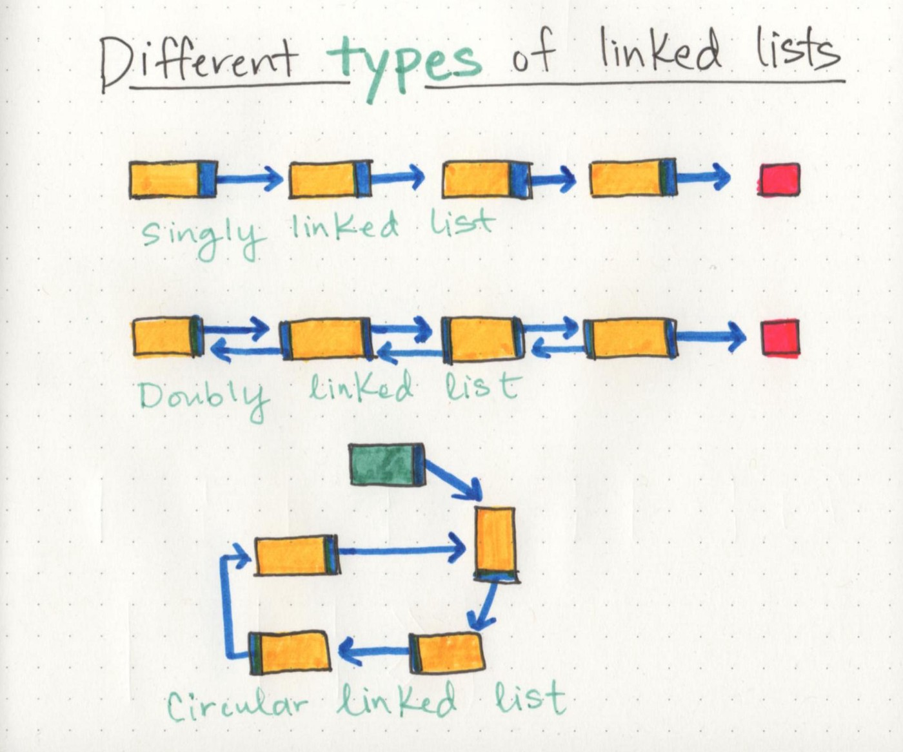

## Linked Lists
notes from these articles:

[CF github](https://codefellows.github.io/common_curriculum/data_structures_and_algorithms/Code_401/class-05/resources/singly_linked_list.html)

[Medium part 1](https://medium.com/basecs/whats-a-linked-list-anyway-part-1-d8b7e6508b9d)

[Medium part 2](https://medium.com/basecs/whats-a-linked-list-anyway-part-2-131d96f71996)

Linked List is a sequence of `Nodes` connected/linked to each other `Singly or Doubly`

### Terminology:
1. **Linked List** - A data structure that contains nodes that links/points to the next node in the list.
2. **Singly** - Singly refers to the number of references the node has. A Singly linked list means that there is only one reference, and the reference points to the Next node in a linked list.
3. **Doubly** - Doubly refers to there being two (double) references within the node. A Doubly linked list means that there is a reference to both the `Next` and `Previous` node.
4. **Node** - Nodes are the individual items/links that live in a linked list. Each node contains the data for each link.
5. **Next** - Each node contains a property called `Next`. This property contains the reference to the next node.
6. **Head** - The Head is a reference type of type `Node` to the first node in a linked list.
7. **Current** - The `Current` reference is a reference type of type `Node` that is currently being looked at. This node is traditionally used when traversing through a full linked list. When traversing, you typically reset the current to the head to guarantee you are starting from the beginning of the linked list.

Remember: When **Traversing** a linked list, you are not able to use a foreach or for loop. We depend on the `Next` value in each node to guide us where the next reference is pointing. The `Next` property is exceptionally important because it will lead us where the next node is and allow us to extract the data appropriately.

Remember: The best way to approach a traversal is through the use of a `while()` loop. This allows us to continually check that the Next node in the list is not null. If we accidentally end up trying to traverse on a node that is null, a `NullReferenceException` gets thrown and our program will crash/end.

**** Look at the example in the first link

Remember:  When constructing your code, a few things to keep in mind.

1. When making your Node class, consider requiring a value to be passed in to require that each node has a value.

2. When making a Linked List, you may want to require that at least one node gets passed in upon instantiation. This first node is what your Head and Current will point too.

- Inserting an element at the beginning: O(1)

- Traversing: O(n)

So...a linked list is usually efficient when it comes to adding and removing most elements, but can be very slow to search and find a single element.

Note: A node only knows about what data it contains, and who its neighbor is.

