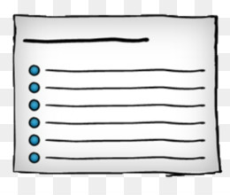

## Lists

see About-me lab for creative bullet CSS syntax

`<ol>, <ul>, <li>` elements; very familiar

unless CSS reset, most browsers treat *ordered* lists with numerical indicators (and subs) and *unordered* lists with bullets (and subs)

`<dl>, <dt>, <dd>` definition lists

unless CSS reset, most browsers treat definition lists with standard indentation (dt = terms, dd = details)

It is possible to next lists