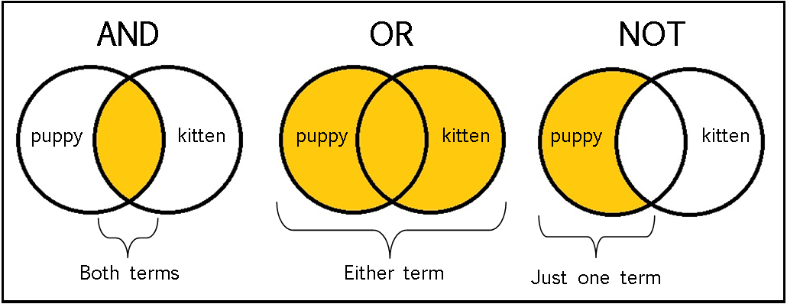

# Comparison *Operators* (as in comparative logic courses taken before)

Six operators:
+ == **equal** to (3 and '3' will return true)
+ === **strictly equal** more useful; same info, same type
+ ! **not** added to equal or se
+ >, <, >=, <= as in math
+ && **logical and**
+ || **logical or**
+ += is same as msg = msg + new msg (see p176)

Using if comparison statement:
``` 
if (score >=50){
    //call function or do action
    congratulate(); 
}
else {
    //note use of ;
    encourage(); 
}
else if {
    //use safety catch all or maybe "try again" loop
}
```

Loops: check a condition, true runs the code block, check again, true runs code block...until false

+ **for** specify number of times (counter)
+ **while** condition something other than a counter and runs as long as condition remains true (could run zero times)
+ **do while** like while but always runs once even if first run evals to false

for (var i=0; i <1 0; i++) do stuff:
+ **initializes** i to 0
+ checks to see if **condition** i is < 0 is true
+ **runs the block of code**
+ **updates** by incrementing i by 1
+ re-runs until i !< 0

See p 172-173 for pictoral of the above loop

NaN (' ') = false because evaluates to **zero** which IS a number (use isNaN built in function)

