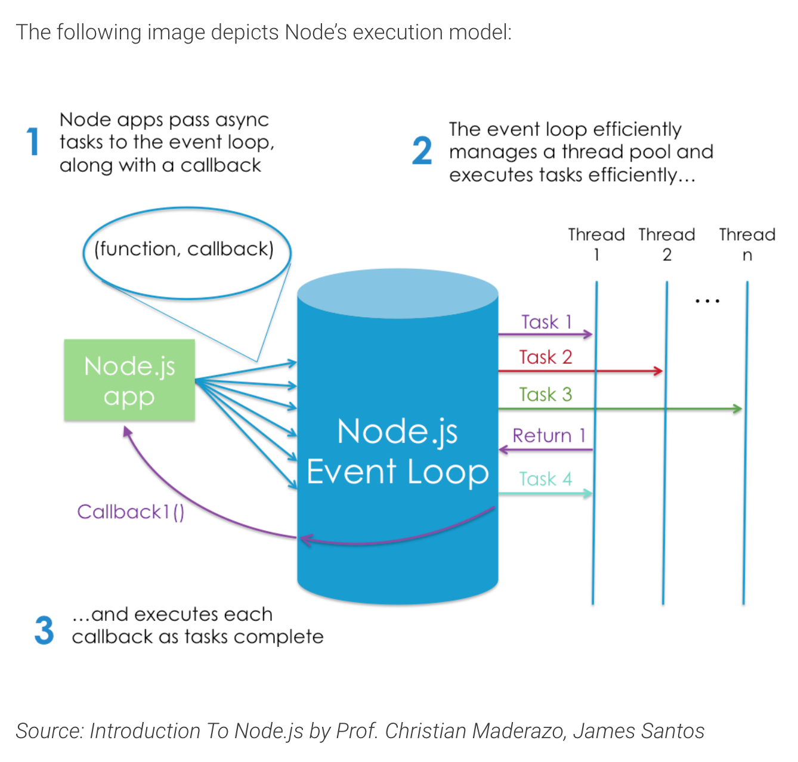

## Node JS

[This article](https://www.sitepoint.com/an-introduction-to-node-js/)

+ Node.js® is a JavaScript runtime built on Chrome’s V8 JavaScript engine.

+ Node.js is an event-based, non-blocking, asynchronous I/O runtime that uses Google’s V8 JavaScript engine and libuv library.

+ !! Node.js is a program we can use to execute JavaScript on our computers. In other words, it’s a JavaScript runtime.

+ Use a version manager instead. This is a program that allows you to install multiple versions of Node and switch between them at will. There are various advantages to using a version manager. For example, it negates potential permission issues when using Node with npm and lets you set a Node version on a per-project basis.

+ quick tip: Install Multiple Versions of Node.js using nvm

+ You can use your terminal as a console log

+ You don’t generally have to worry about compatibility issues 

+ Node comes bundled with a package manager called npm.

+ everything that happens in Node is in reaction to an event

+ you can easily share code between the server and the client

+ Another of Node’s big pluses is that it speaks JSON. JSON is probably the most important data exchange format on the Web, and the lingua franca for interacting with object databases (such as MongoDB). JSON is ideally suited for consumption by a JavaScript program, meaning that when you’re working with Node, data can flow neatly between layers without the need for reformatting. You can have one syntax from browser to server to database.

+ It can also be used to write your own command line tool, such as this Yeoman-Style generator to scaffold out new projects.

+ Node.js can also can be used to build cross-platform desktop apps and even to create your own robots. What’s not to love?

