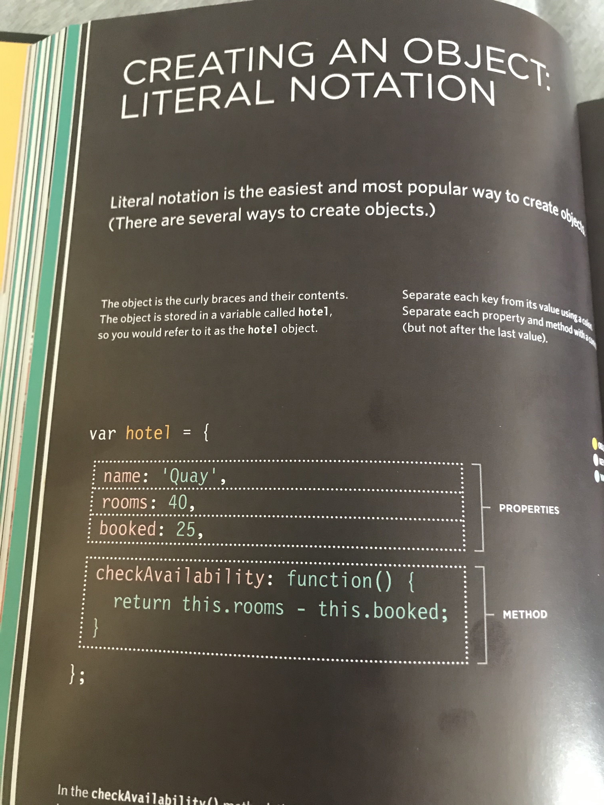
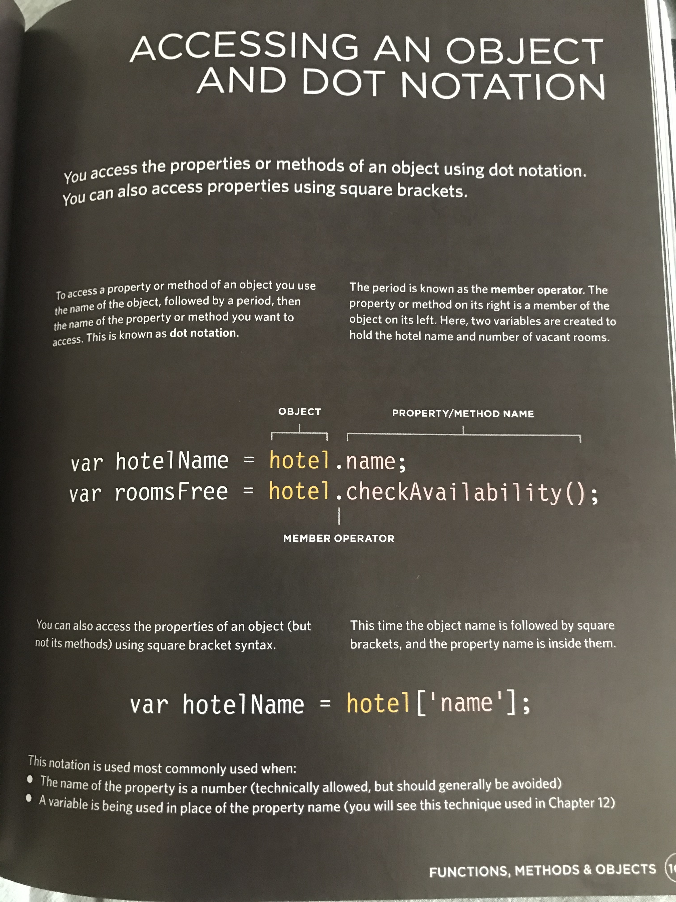

## Object Literals (pp 100-105)

+ Object: group together a set of variables and functions to create a model of something recognizable

+ In an object, variables = **properties**

+ In an object, functions = **methods**

+ Properties and methods have **key/value** pairs
    - Property values = **type** assigned
    - Methods value = **function**
    - see 102-103 for notation
+ Access properties or methods using dot notation: 

    `var hotelName = hotel.name`
+ Access properties or methods using bracket notation: 

    `var hotelName = hotel['name']`

+ **Remember CSS Diner exercise**
+ HTML: attribute name/value
+ CSS: property name/value

## Document Object Model (DOM) (pp. 183-242)--many unfamiliar commands; refer to book!!

+ DOM specifies how browsers should create a model of an HTML page and how JavaScript can access and update contents while in the browser window

+ Common API (Application Programming Interface) for scripts to talk to each other

+ Browsers use a DOM tree; can view in browser dev tools (**Elements**); older browsers DOM is inconsistent

+ Four types of nodes:
    - document
    - text
    - attribute
    - element

+ Element nodes selected by:
    - id
    - class
    - tag name
    - CSS selector syntax

+ Element nodes can contain multiple text nodes--children that are siblings

+ Element nodes accessed and updated using DOM manipulation or `textContent` or `innerHTML`

+ Find element nodes using **text content**, **children**, and **attributes** using **DOM Queries**
(pp. 188-189).  Save common queries as variables

+ 196-207!!! Nodelists query returns
+ !! use validation methods to avoid XSS (Cross-Site Scripting Attacks)(pp. 228-229)

## Template Literals

`console.log('My name is', this.name)`

Use: console.log (`My last name is ${this.lastName}.  It's Greek`) string within `` instead of concatanation

