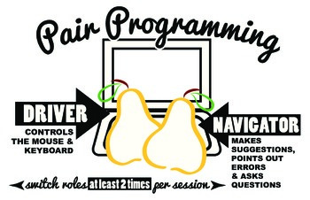

## Notes on [THIS](https://www.codefellows.org/blog/6-reasons-for-pair-programming/) article

Common to agile work environments

+ Driver handles mechanics 

+ Navigator considers logic, algorithms, big picture, and syntax double-check/lookups

Works on all four comm skills
+ listening
+ speaking
+ reading
+ writing

Benefits:
+ Greater efficiency: may take a little longer but produces higher quality and often less debuggin/troubleshooting

+ Engaged collaboration: no procrastination, boost confidence in prob solving

+ Learning from other students: see different approaches; trade skills; learn to explain the code

+ Social skills: can't just take over or work in a vacuum

+ Job interview readiness: exercise to see how applicant fits into the team; demo ability to work with and learn from others

+ Work environment readiness: many companies use; familiarity w/ PP means company doesn't need to train

