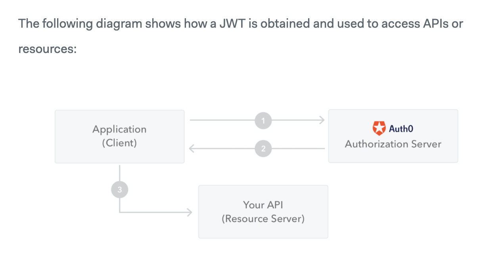

# Authentication and Production Server

______________

notes from [this article](https://jwt.io/introduction/) on JSON web tokens (JWT)

__________

JWT defines a compact and self-contained way for securely transmitting information between parties as a JSON object. 

This information can be verified and trusted because it is digitally signed.

Although JWTs can be encrypted to also provide secrecy between parties, we will focus on signed tokens:
    -  Signed tokens can verify the integrity of the claims contained within it
    - Encrypted tokens hide those claims from other parties

Used in Authorization and Information Exchange

JWT structure:  xxxx.yyyy.zzzz

xxxx = Header: contains the type of token and identifies the signature algorithm

yyyy = Payload: Claims

1. Registered: a set of predefined claims which are not mandatory but recommended, to provide a set of useful, interoperable claims. Some of them are: iss (issuer), exp (expiration time), sub (subject), aud (audience), and others.

2. Public: defined at will by those using JWTs. But to avoid collisions they should be defined in the IANA JSON Web Token Registry or be defined as a URI that contains a collision resistant namespace.

3. Private: custom claims created to share information between parties that agree on using them and are neither registered or public claims.

zzzz = Signature: To create the signature part you have to take the encoded header, the encoded payload, a secret, the algorithm specified in the header, and sign that.

You can use [jwt.io Debugger](https://jwt.io/#debugger-io) to decode, verify, and generate JWTs.

When the user successfully logs in using their credentials, a JSON Web Token will be returned

Whenever the user wants to access a protected route or resource, the user agent should send the JWT, typically in the Authorization header using the Bearer schema.
`Authorization: Bearer <token>`

If you want to read more about JSON Web Tokens and even start using them to perform authentication in your own applications, browse to the [JSON Web Token landing page](https://auth0.com/learn/json-web-tokens/?_ga=2.25210239.351064034.1616536437-483071832.1616536437) at Auth0.
___________

notes from [this article](https://simpleisbetterthancomplex.com/tutorial/2018/12/19/how-to-use-jwt-authentication-with-django-rest-framework.html) on using JWT with Django REST framework

_________

The JWT is acquired by exchanging a username + password for an `access token` and an `refresh token`.

    - The access token is usually short-lived (expires in 5 min or so, can be customized though)

    - The refresh token lives a little bit longer (expires in 24 hours, also customizable). It is comparable to an authentication session. After it expires, you need a full login with username + password again.

A great tutorial: [How to Implement Token Authentication using Django REST Framework](https://simpleisbetterthancomplex.com/tutorial/2018/11/22/how-to-implement-token-authentication-using-django-rest-framework.html)

_________

Additional reading:
[Django Migrations](https://realpython.com/django-migrations-a-primer/)