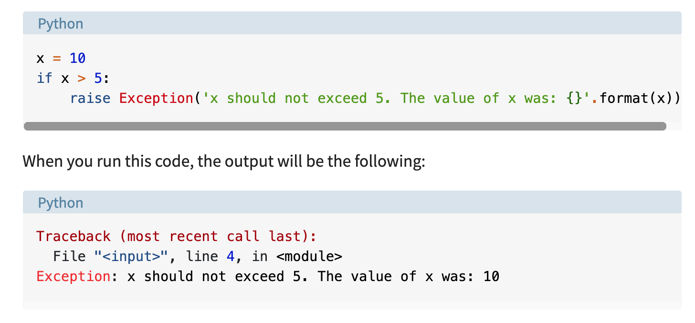

## Exceptions

info from [this article](https://realpython.com/python-exceptions/)

The interpreter will tell you if it's a **syntax error**

(fix your code where ^ indicates and rerun)

or **an exception**

(descriptive: note the type of exception)

A list of built in exception classes can be found [here](https://docs.python.org/3/library/exceptions.html)

But you can build your own

Or you can make an assertion, and the program will throw an assertion error if/when the condition is false.  Like this example:

You can build in a try and except block.  You can use "pass" in the except block but more description to the user is better:

Using pass or a print statement like this means the program does not crash, but it does not execute the command that threw the exception.

Avoid bare exception blocks, especially since catching an exception hides ALL errors from the user

Again, you can use the built-in exceptions listed [here](https://docs.python.org/3/library/exceptions.html)

You can build in a block that executes if no exceptions occur by using try-except-else.  The else block can also include nested exception catches

Lastly, you can use the finally block to always run code, exception or not

