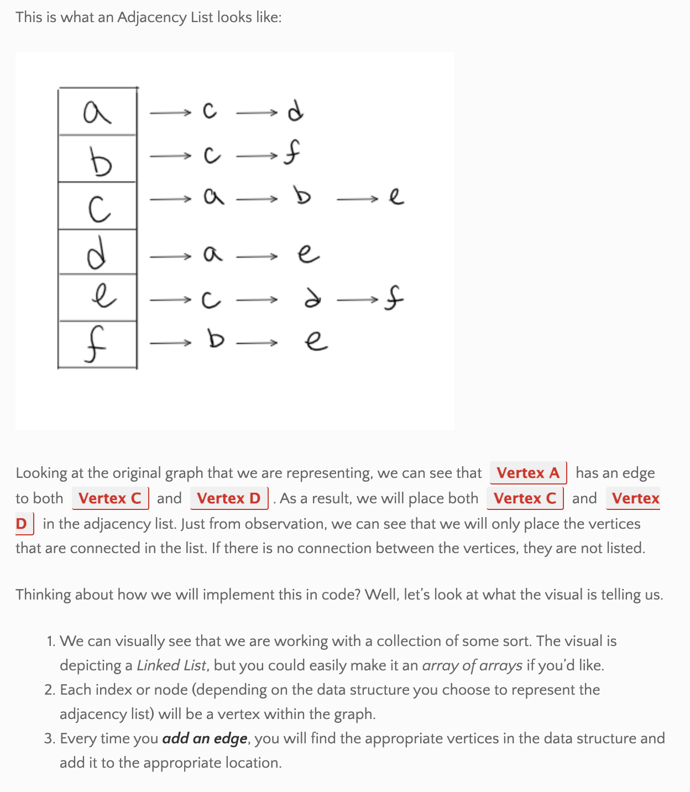
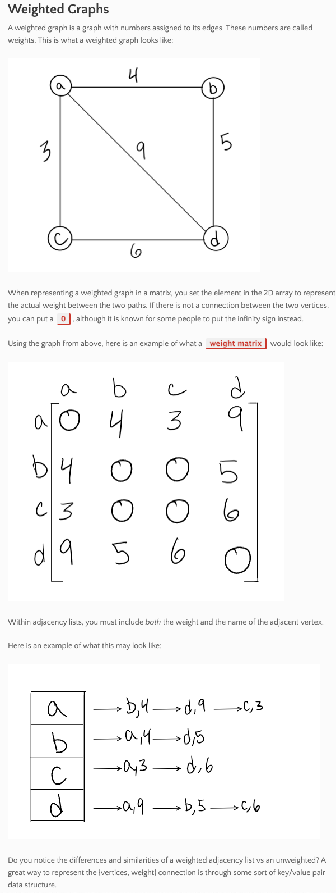

### Graphs -- the datastructure not the visual

notes from [this article](https://codefellows.github.io/common_curriculum/data_structures_and_algorithms/Code_401/class-35/resources/graphs.html)

A Graph has vertices (nodes) and edges, neighbors (connected by edges), and a vertex degrees (number of edges connected to that vertex)

Undirected: edges are bi-directional or undirected

Directed or Digraph:  edges have direction

Complete:  all nodes are connected to all other nodes (all vertices have the same degree)

Connected: all vertices have at least one edge

Disconnected: one/some verices do not have edges

Cycle: traverse the graph in a path of positive length and finish up at the starting vertex

Acyclic: no cycles.  Cyclic:  has cycles

Directed, Acyclic Graph (DAG) == tree

Represent graphs through:
1. Adjacency Matrix (binary 0,1 in each row/col intersection)
2. Adjacency List (most common way to represent)

Sparse: few connections.  Dense: many connections

Weighted: Numbers assigned to edges.  Represented using a weight matrix or adjacency list

Graphs are traversed like trees in `Breadth First` or `Depth First` fashion using Enqueue/Dequeue, Push, Peek, and Pop

**** see the article for a good reminder of tree traversal

Examples of RW use of Graphs (many more!):

1. GPS and Mapping
2. Driving Directions
3. Social Networks
4. Airline Traffic
5. Netflix uses graphs for suggestions of products

