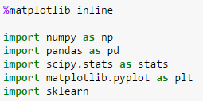

## Linear Regression with Python

notes from [this article](https://bigdata-madesimple.com/how-to-run-linear-regression-in-python-scikit-learn/)

and a refresher on [linear regression](https://www.statisticssolutions.com/what-is-linear-regression/)

The overall idea of regression is to examine two things: (1) does a set of predictor variables do a good job in predicting an outcome (dependent) variable?  (2) Which variables in particular are significant predictors of the outcome variable, and in what way do they–indicated by the magnitude and sign of the beta estimates–impact the outcome variable? 

The simplest form of the regression equation with one dependent and one independent variable is defined by the formula y = c + b*x, where y = estimated dependent variable score, c = constant, b = regression coefficient, and x = score on the independent variable.

Three major uses for regression analysis are (1) determining the strength of predictors, (2) forecasting an effect, and (3) trend forecasting.

### Using Python scikit-learn

There are several ways in which you can do that, you can do linear regression using numpy, scipy, stats model and sckit learn.

Scikit-learn is a powerful Python module for machine learning. It contains function for regression, classification, clustering, model selection and dimensionality reduction.

first, import:

 The article explores data using a dictionary and converts it to a pandas df. The author's goal is to predict housing prices based on factors using `Least Squares`

 Exlore available functions using `.lm<tab>`  Commonly used:

 lm.fit() -> fits a linear model

lm.predict() -> Predict Y using the linear model with estimated coefficients

lm.score() -> Returns the coefficient of determination (R^2). A measure of how well observed outcomes are replicated by the model, as the proportion of total variation of outcomes explained by the model.

`.coef_ gives` the coefficients and `.intercept_` gives the estimated intercepts.

Positive correlation between number of rooms and housing prices is obvious looking at a scatter plot, coded like this:

In practice you wont implement linear regression on the entire data set, you will have to split the data sets into training and test data sets. So that you train your model on training data and see how well it performed on test data.

Use `.train_test_split`

Calculate MSE by:

Input:
1. print “Fit a model X_train, and calculate MSE with Y_train:”, np.mean((Y_train – lm.predict(X_train)) ** 2)

2. print “Fit a model X_train, and calculate MSE with X_test, Y_test:”, np.mean((Y_test – lm.predict(X_test)) ** 2)

Output:
1. Fit a model X_train, and calculate MSE with Y_train: 19.5467584735 Fit a model X_train, and calculate MSE with X_test, Y_test: 28.5413672756

Use Residual Scatter Plot to look at the predicted error:

