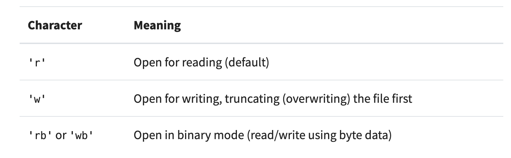
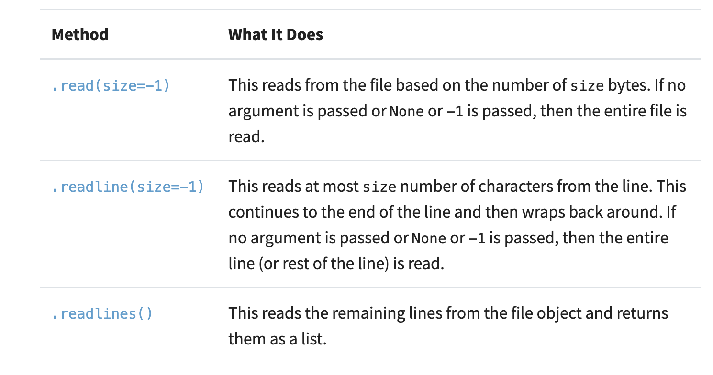
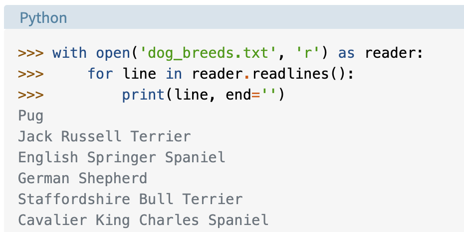
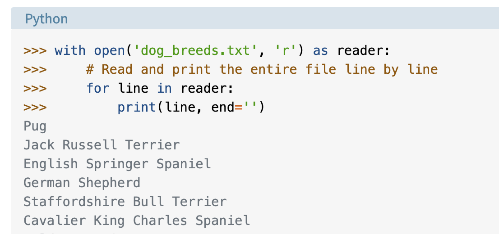
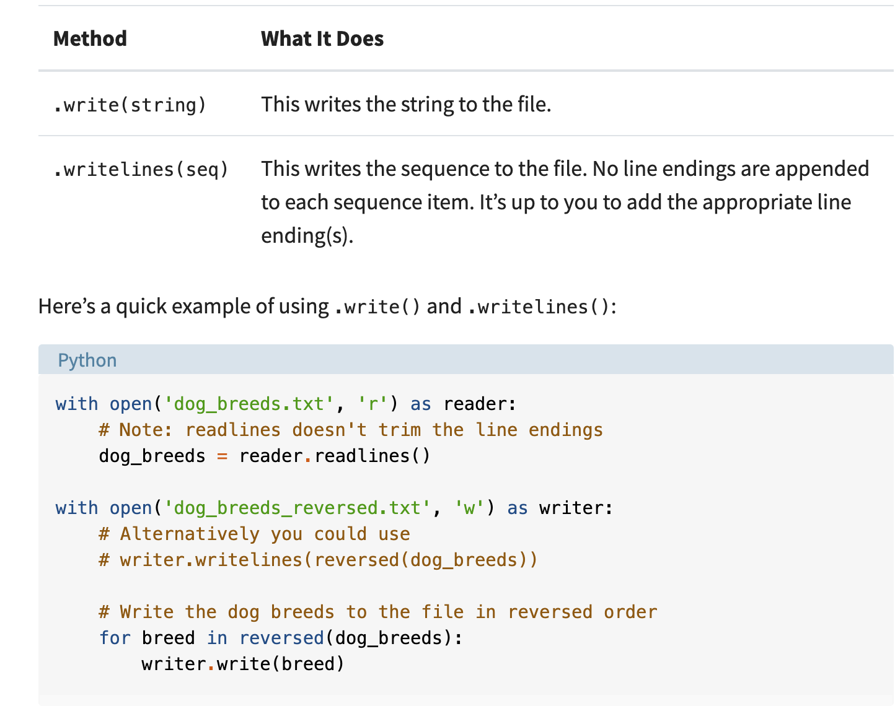
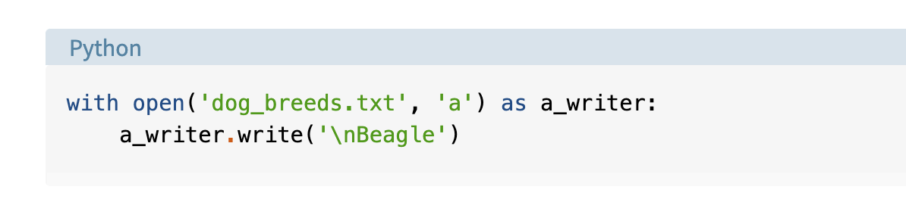
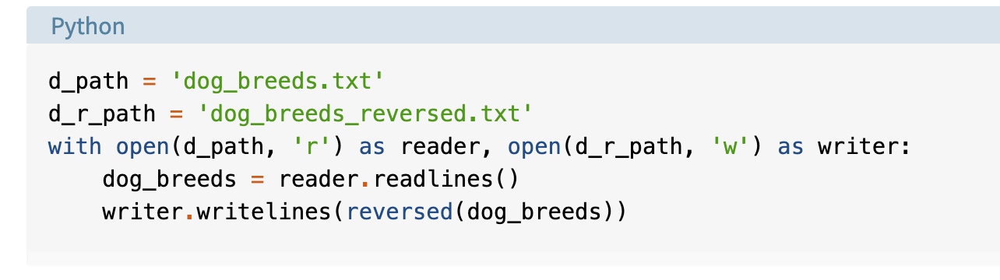
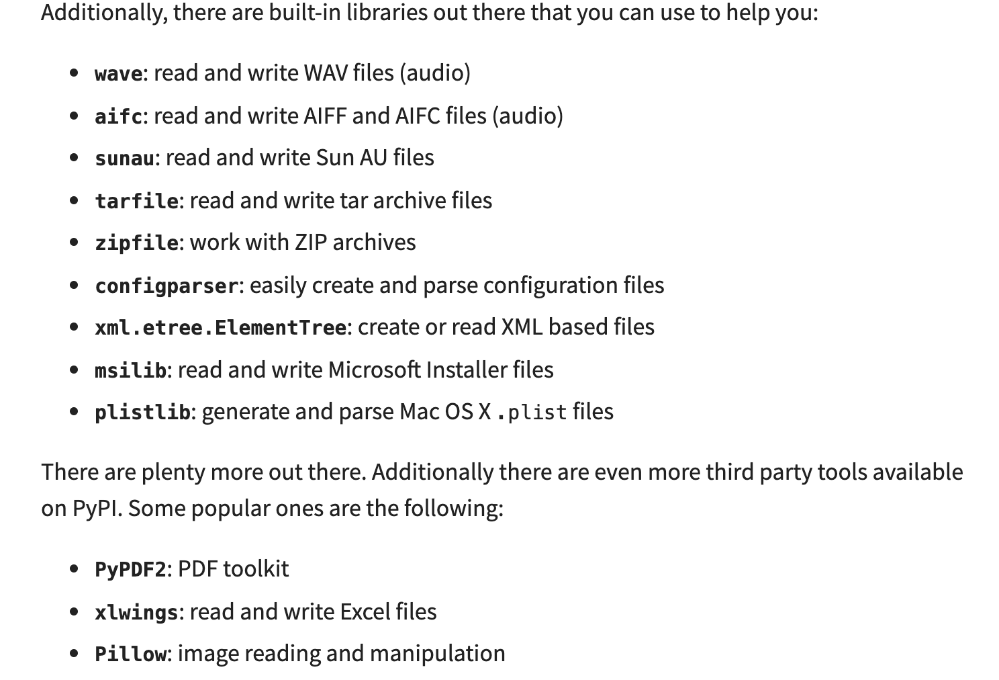

## Read and Write Python Files

notes from [this article](https://realpython.com/read-write-files-python/)

A file is a **continguous** block of bytes used to store data that contains:

1. Header: metadata about the contents of the file (file name, size, type, and so on)
2. Data: contents of the file as written by the creator or editor
3. End of file (EOF): special character that indicates the end of the file

The extension usually gives clue to what type of data is stored (.jpg, .txt, etc)

A file path is needed to access the data:

1. Folder Path: the file folder location on the file system where subsequent folders are separated by a forward slash / (Unix) or backslash \ (Windows)
2. File Name: the actual name of the file
3. Extension: the end of the file path pre-pended with a period (.) used to indicate the file type

[this](https://realpython.com/working-with-files-in-python/) page gives more information about working with file data

You must account for a common issue: line ending characters could be interpreted differently by a different OS. 

Encoding is another common issue.  The data could be in ASCII or Unicode(UTF-8)

`var = open('filename.ext')` is used to open.  

Remember to always close with `var.close()` or make it automatically close
`with open('filename.ext') as var:`

Common opening modes are often used with either method of opening `with open('filename.ext', 'mode') as var:`

Once it's open, there are different methods for reading the file--each producing different output. Each character is roughly a byte for the `size` argument:

You can interate over each line, but Python `readlines()` does the same:

or you can iterate over the file: 

A couple of methods to write lines:

You can open a file and read the header in bytes. The header tells you what kind of file it is.

`__file__` special attribute returns the ***relative*** path of the file.  Useful for printing the file path for testing or other actions

You can append to a file using the `a` mode

You can work 2 files at the same time:

The article has a template to create a context manager or you can read more in the [Python docs](https://docs.python.org/3/library/stdtypes.html#typecontextmanager)

A useful article: [Working with JSON](https://realpython.com/python-json/)

There are built-in libraries and 3rd party tools for different file types:

