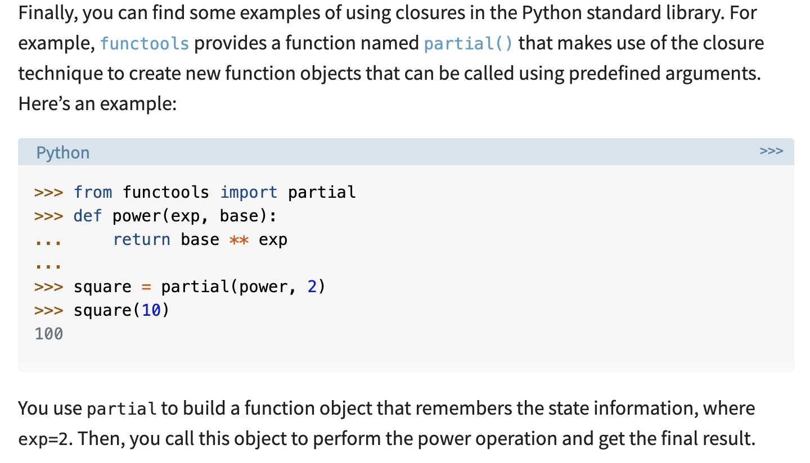
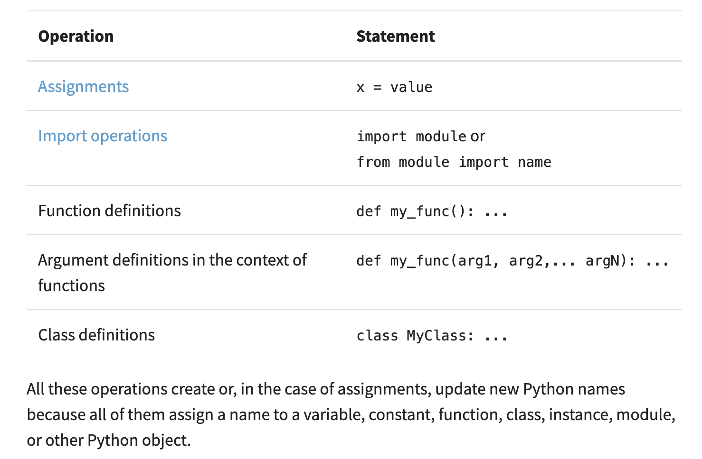
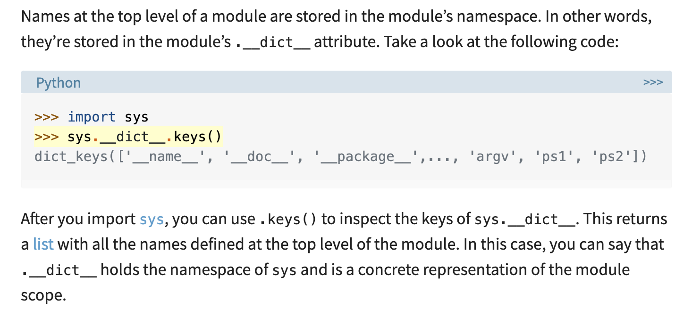

## Python Scope

notes from [this article](https://realpython.com/python-scope-legb-rule/)

### --Why Scope?--
For good programming, take advantage of Python scope to 
- Avoid or minimize bugs related to name collision

- Make good use of global and local names across your programs to improve code maintainability

- Use a coherent strategy to access, modify, or update names across all your Python code

### --LEGB--
The Python scope concept is generally presented using a rule known as the `LEGB` rule: **Local, Enclosing, Global, and Built-in** scopes. 

This summarizes not only the Python scope levels but also the sequence of steps that Python follows when resolving names in a program.

1. Local (or function) scope is the code block or body of any Python function or lambda expression. This Python scope contains the names that you define inside the function. These names will only be visible from the code of the function. It’s created at function call, not at function definition, so you’ll have as many different local scopes as function calls. This is true even if you call the same function multiple times, or recursively. Each call will result in a new local scope being created.

2. Nested Functions: Enclosing (or nonlocal) scope is a special scope that only exists for nested functions. If the local scope is an inner or nested function, then the enclosing scope is the scope of the outer or enclosing function. This scope contains the names that you define in the enclosing function. The names in the enclosing scope are visible from the code of the inner and enclosing functions.

- Similarly to global names, nonlocal names can be accessed from inner functions, but not assigned or updated. If you want to modify them, then you need to use a `nonlocal statement`. With a nonlocal statement, you can define a list of names that are going to be treated as nonlocal.

```
def func():
# A nonlocal variable
     var = 100  
     def nested():
# Declare var as nonlocal
         nonlocal var  
         var += 100

     nested()
     print(var)

func()
# output = 200
```
- In contrast to global, you can’t use nonlocal to create lazy nonlocal names. Names must already exist in the enclosing Python scope if you want to use them as nonlocal names. This means that you can’t create nonlocal names by declaring them in a nonlocal statement in a nested function. 

- `Closures` are a special use case of the enclosing Python scope. When you handle a nested function as data, the statements that make up that function are packaged together with the environment in which they execute (signified by their argument). The resulting object is known as a closure. In other words, a closure is an inner or nested function that carries information about its enclosing scope, even though this scope has completed its execution.

>>Note: Variables used as function arguments are called free variables. They are variables that are used in a code block but not defined there. Free variables are the mechanism that closures use to retain state information between calls.

>>Note: You can also call this kind of function a factory, a factory function, or—to be more precise—a closure factory to specify that the function builds and returns closures (an inner function), rather than classes or instances.



3. Global (or module) scope is the top-most scope in a Python program, script, or module. This Python scope contains all of the names that you define at the top level of a program or a module. Names in this Python scope are visible from everywhere in your code.

The `global` Statement:

- You already know that when you try to assign a value to a global name inside a function, you create a new local name in the function scope. To modify this behavior, you can use a global statement. With this statement, you can define a list of names that are going to be treated as global names.
```
 def update_counter():
 # Declare counter as global
     global counter  
# Successfully update the counter
     counter = counter + 1  
```

4. Built-in scope is a special Python scope that’s created or loaded whenever you run a script or open an interactive session. This scope contains names such as keywords, functions, exceptions, and other attributes that are built into Python. Names in this Python scope are also available from everywhere in your code. It’s automatically loaded by Python when you run a program or script.


Python use scope to avoid the problem of any part of the program being able to modify variables if only Global variables are used. When you use a language that implements scope, there’s no way for you to access all the variables in a program at all locations in that program. In this case, your ability to access a given name will depend on where you’ve defined that name.

The names in your programs will have the scope of the block of code in which you define them. When you can access the value of a given name from someplace in your code, you’ll say that the name is in scope. If you can’t access the name, then you’ll say that the name is out of scope.



Python scopes are implemented as dictionaries that map names to objects. These dictionaries are commonly called namespaces. These are the concrete mechanisms that Python uses to store names. They’re stored in a special attribute called `.__dict__.`



### --Importing--
In the latest import operation, you use the form from <module> import <name>. This way, you can use the imported name directly in your code. In other words, you don’t need to explicitly use the dot notation.

Relative vs Absolute importing info can be found [here](https://realpython.com/absolute-vs-relative-python-imports/)

### --Other than LEGB scopes--

You’ll find some Python structures where name resolution seems not to fit into the LEGB rule for Python scopes. These structures include:

- Comprehensions
    - Once you run list comprehension the variable is no longer accessible.  See [here](https://realpython.com/list-comprehension-python/) for more on list comprehension
- Exception blocks
    - The exception variable is a variable that holds a reference to the exception raised by a try statement. In Python 3.x, such variables are local to the except block and are forgotten when the block ends.
- Classes and instances
    - When you define a class, you’re creating a new local Python scope. The names assigned at the top level of the class live in this local scope. The names that you assigned inside a class statement don’t clash with names elsewhere. You can say that these names follow the LEGB rule, where the class block represents the L level.

    - Unlike functions, the class local scope isn’t created at call time, but at execution time. Each class object has its own .__dict__ attribute that holds the class scope or namespace where all the class attributes live.

### --Resolving Names--

In general, when you’re writing object-oriented code in Python and you try to access an attribute, your program takes the following steps:

1. Check the instance local scope or namespace first.
2. If the attribute is not found there, then check the class local scope or namespace.
3. If the name doesn’t exist in the class namespace either, then you’ll get an AttributeError.

This is the underlying mechanism by which Python resolves names in classes and instances.

With an instance attribute and a class attribute with the same name var. You can use the following code to access each of them:

- Instance: Use self.var to access this attribute.
- Class: Use A.var to access this attribute.

Since both cases use the dot notation, there are no name collision problems.

### --Using Scope Related Built-In Functions--
There are many built-in functions that are closely related to the concept of Python scope and namespaces. In previous sections, you’ve used dir() to get information on the names that exist in a given scope. Besides dir(), there are some other built-in functions that can help you out when you’re trying to get information about a Python scope or namespace. In this section, you’ll cover how to work with:

- `globals()`: returns a reference to the current global scope or namespace dictionary.  You can iterate through it through it using these traditional methods: .keys(); .values(); .items()

- `locals()`: updates and returns a dictionary that holds a copy of the current state of the local Python scope or namespace. When you call locals() in a function block, you get all the names assigned in the local or function scope up to the point where you call locals().

- `dir()`: without arguments to get the list of names in the current Python scope. If you call dir() with an argument, then the function attempts to return a list of valid attributes for that object
- `vars()`: returns the `.__dict__` attribute of a module, class, instance, or any other object which has a dictionary attribute. Remember that .`__dict__` is a special dictionary that Python uses to implement namespaces.

Since all these are built-in functions, they’re available for free in the built-in scope. This means that you can use them at any time without importing anything. Most of these functions are intended to be used in an interactive session to get information on different Python objects. However, you can find some interesting use cases for them in your code as well.