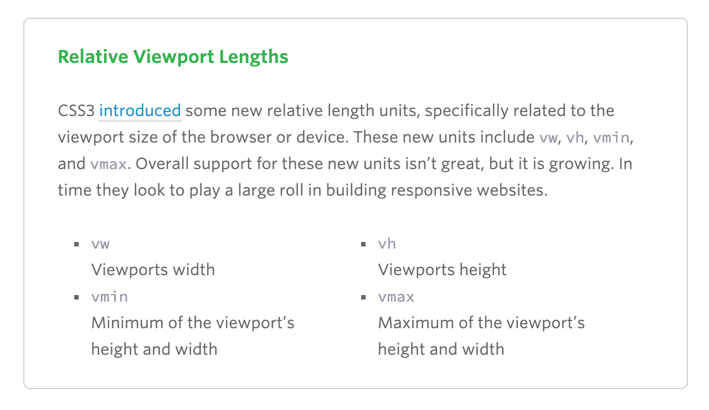
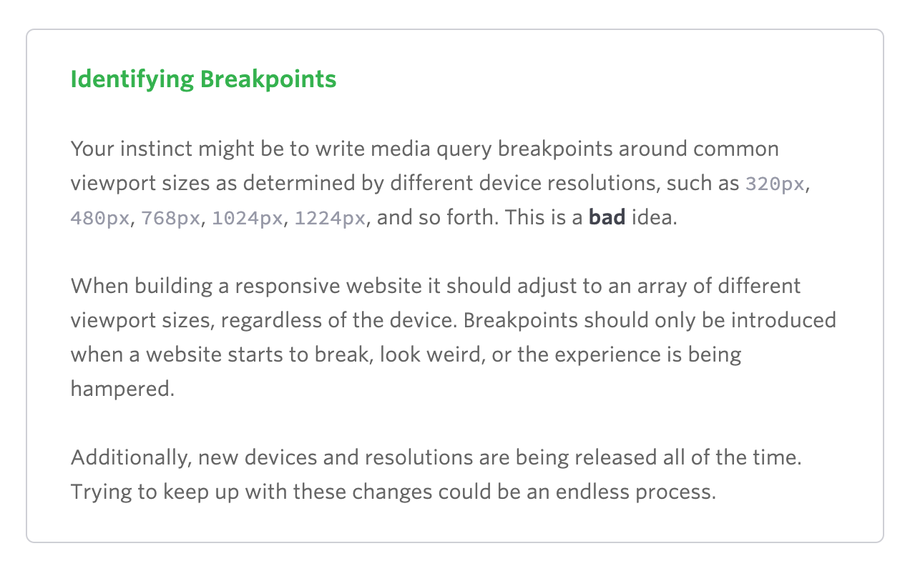

## Responsive Web Design
(or....this aligns with how I was taught)

[this article](https://learn.shayhowe.com/advanced-html-css/responsive-web-design/)

RWD has become more important now that people browse on smaller screens.

RWD, in my opinion, should take the place of developing mobile-only websites if a company has need for both mobile and desktop.  

The user shouldn't be subjected to a vastly different experience on mobile, but should see a pared-down version of the full site.

RWD is easily achieved with `@media` queries in CSS.

CSS3 introduced additional viewport language that makes RWD easier

Hard media query breakpoints and column/container grid structures have been replaced with FLEX (you know this, Kim) and ...

