## Stacks and Queue

notes from [this article](https://codefellows.github.io/common_curriculum/data_structures_and_algorithms/Code_401/class-10/resources/stacks_and_queues.html)

### Stacks
- data structure consisting of Nodes

- `push`--put onto stack.  O(1): assign `new` to `top` and `new.next` to original `top`
**(see visuals)

- `pop`--remove `top` from stack. O(1): reassign `top` to Node below and return `top` to user. Typically check `isEmpty` before popping.
**(error if empty) **(see visuals)

- `top`--top node or item on the stack

- `peek`--view the ***value*** of the `top`. O(1).   Pseudo: `return top.value` Do not reassign `.next` since top remains unchanged
Typically check `isEmpty` before.**(error if empty)

- `isEmpty`--returns boolean.  O(1) `return top = NULL`

>>*** Can be FILO or LIFO

### Push
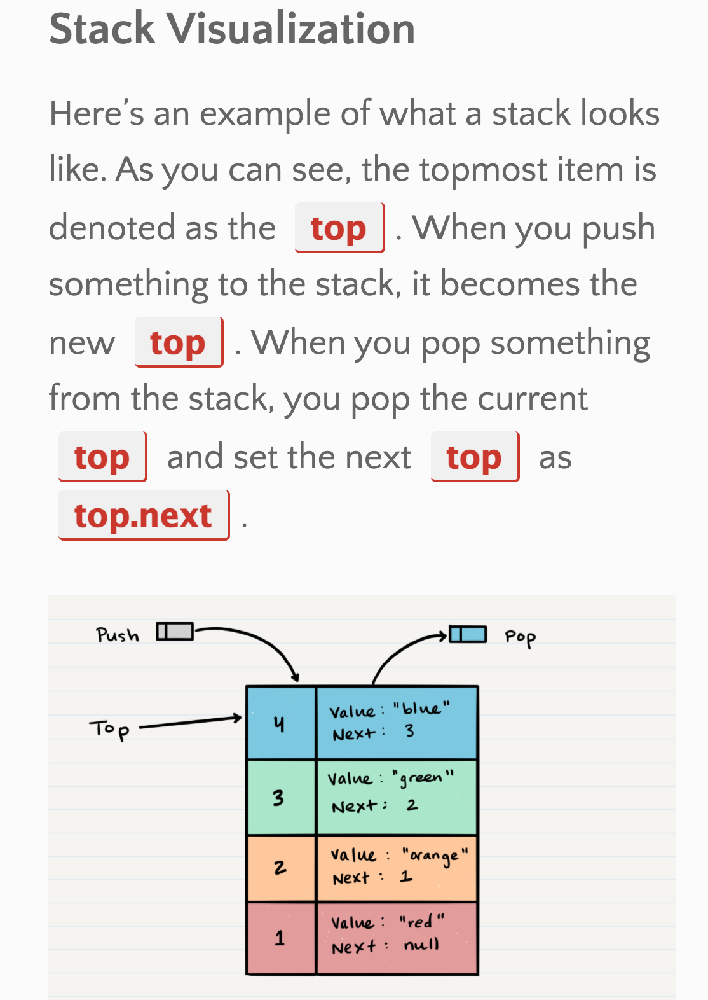

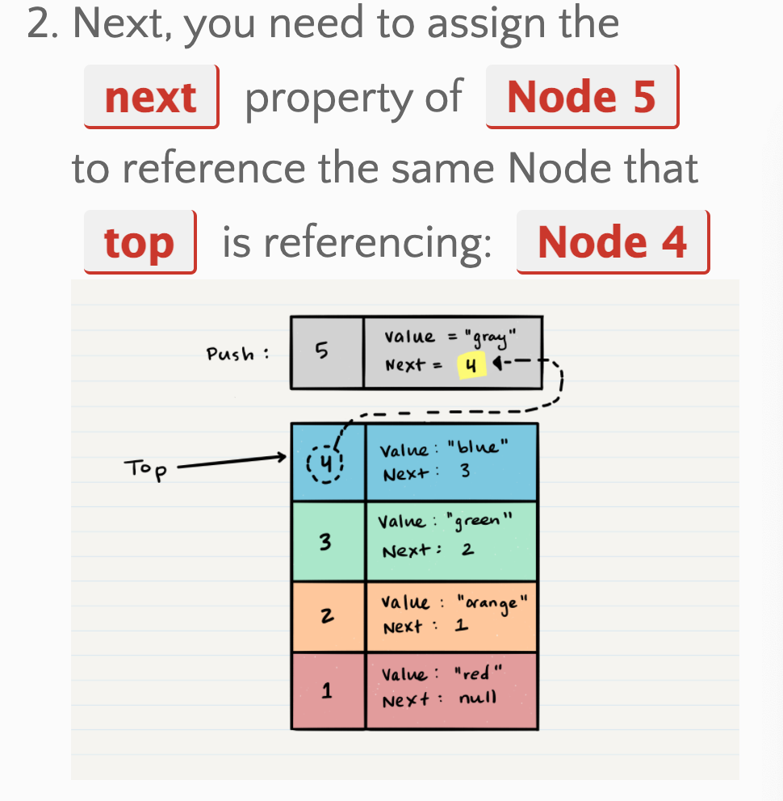

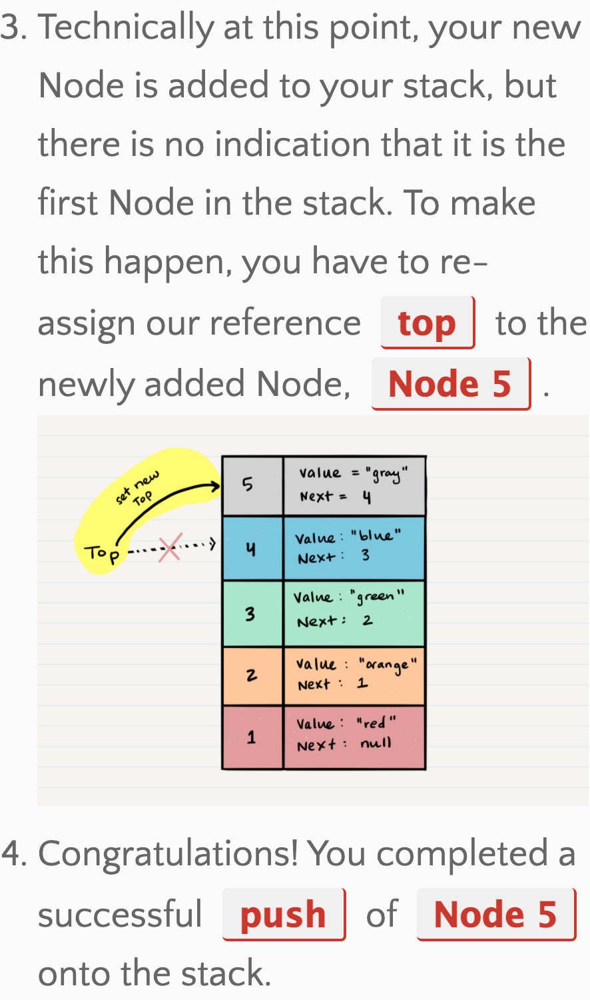

### Pop
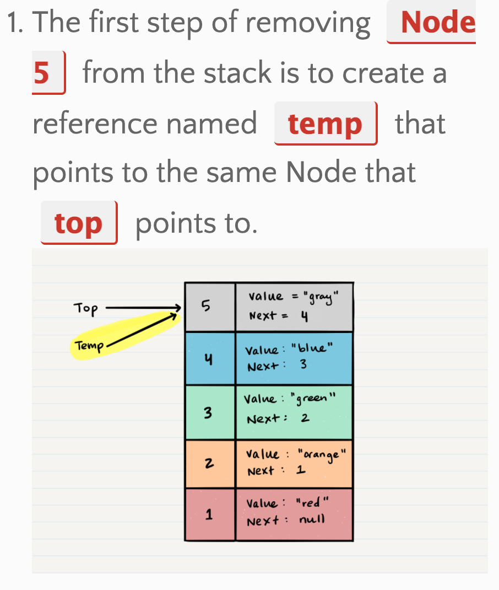

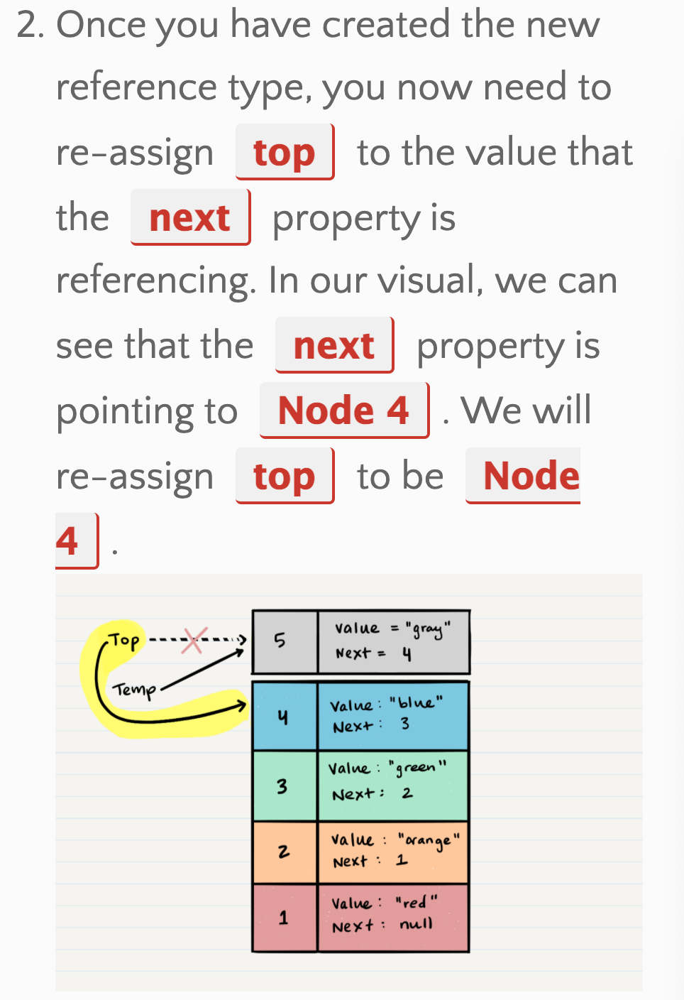

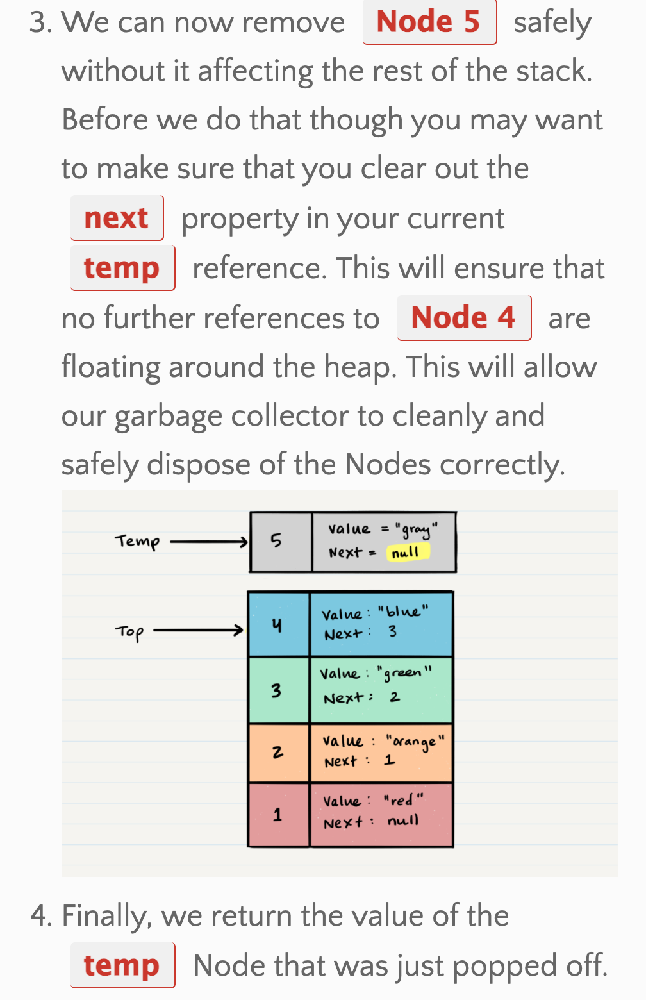

### Queues

- data structure consisting of Nodes

- `enqueue`--put into queue at `rear`.  O(1): 
**(see visuals)

- `dequeue`--remove `front` from queue. O(1): reassign `front` to Node below and return `front` to user. Typically check `isEmpty` before popping.
**(error if empty) **(see visuals)

- `front`--first node or item in the queue

- `rear`--last Node of the queue

- `peek`--view the ***value*** of `front`. O(1).   Pseudo: `return front.value` Do not reassign `.next` since front remains unchanged
Typically check `isEmpty` before.**(error if empty)

- `isEmpty`--returns boolean.  O(1) `return front = NULL`

>>*** Can be FIFO or LILO

### Enqueue
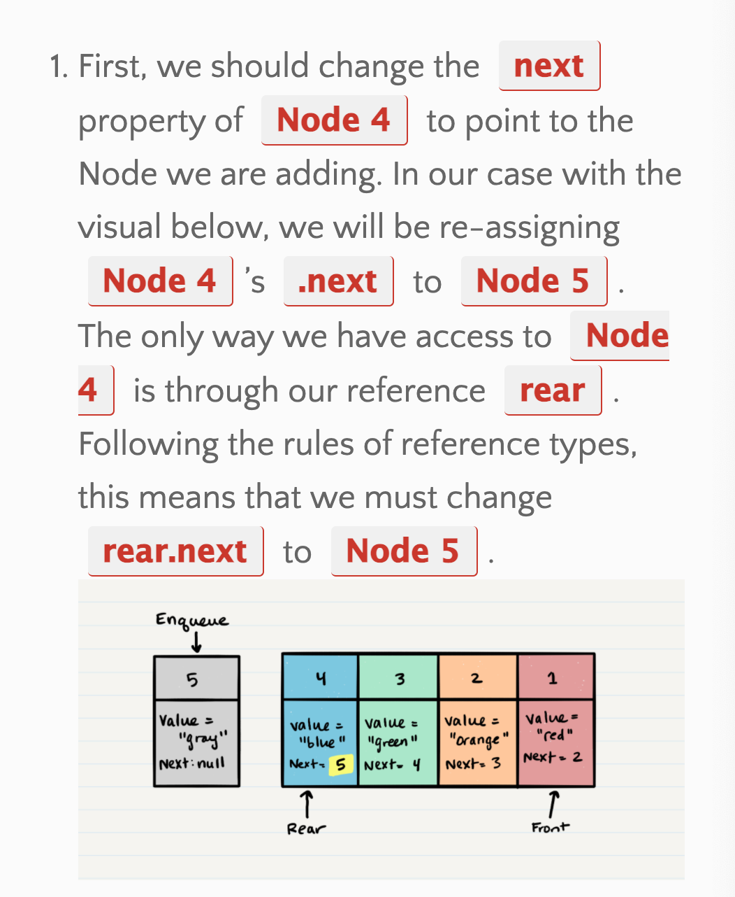

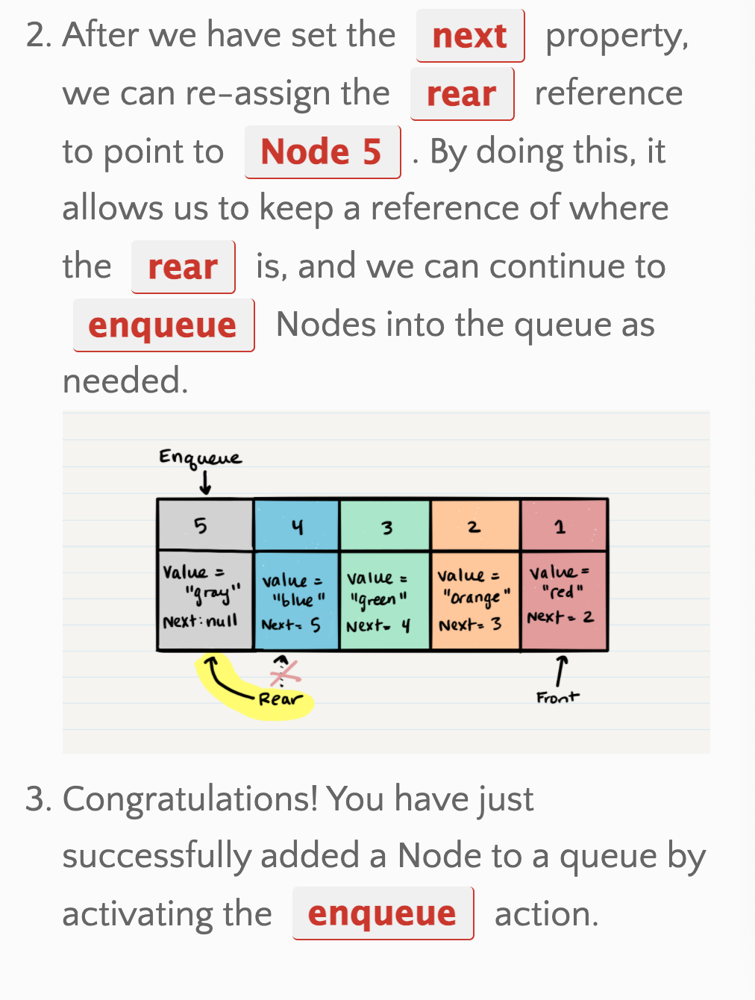
```
ALGORITHM enqueue(value)
// INPUT <-- value to add to queue (will be wrapped in Node internally)
// OUTPUT <-- none
   node = new Node(value)
   rear.next <-- node
   rear <-- node
```
### Dequeue

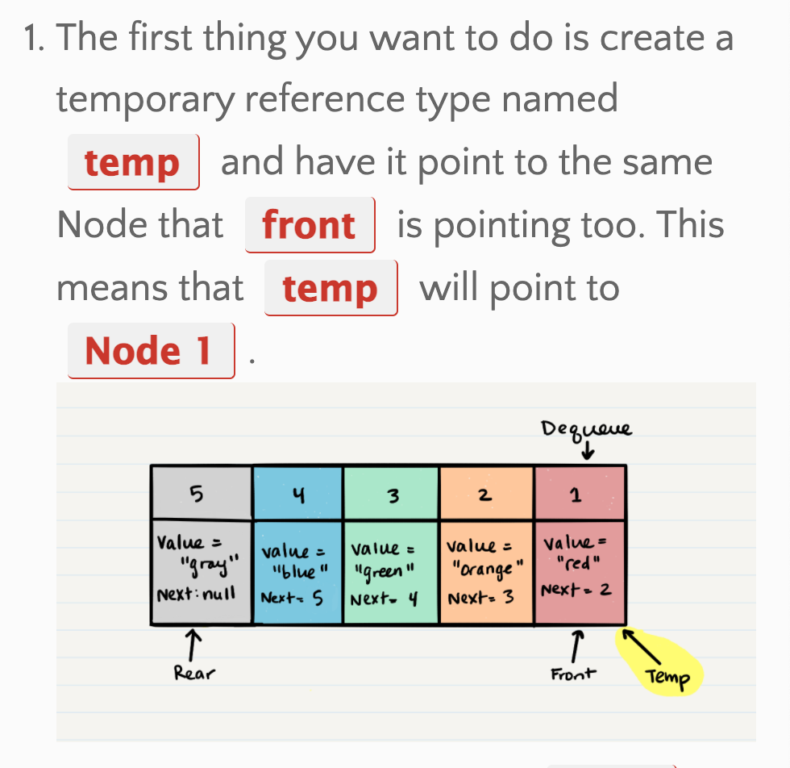

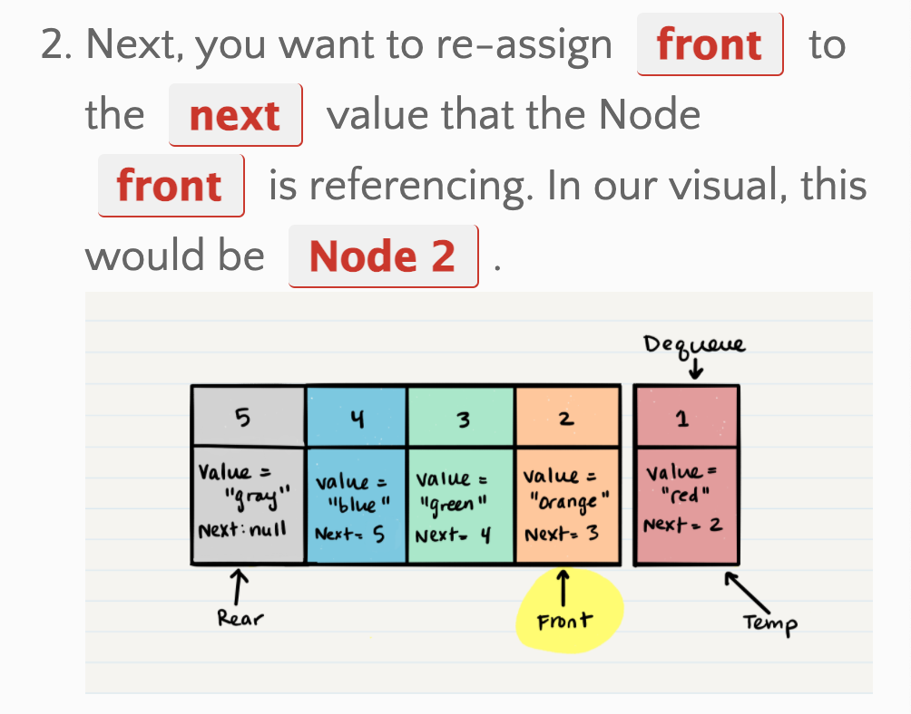

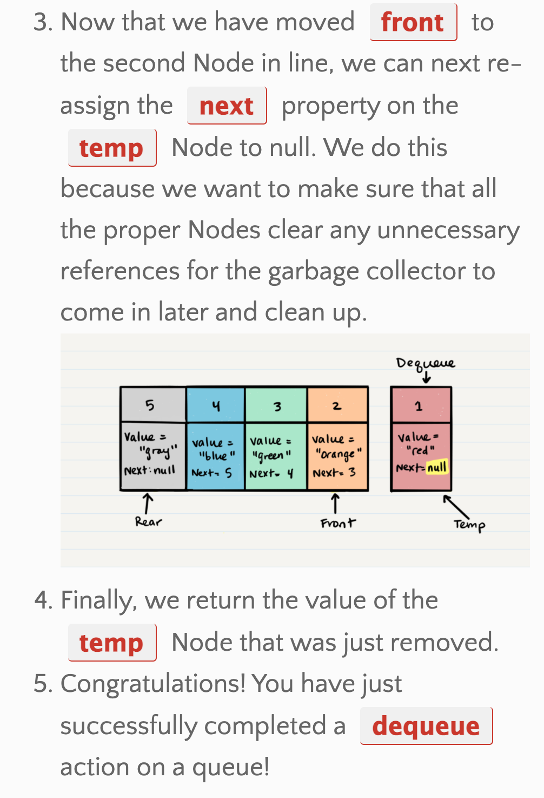

```
ALGORITHM dequeue()
// INPUT <-- none
// OUTPUT <-- value of the removed Node
// EXCEPTION if queue is empty

   Node temp <-- front
   front <-- front.next
   temp.next <-- null

   return temp.value
```