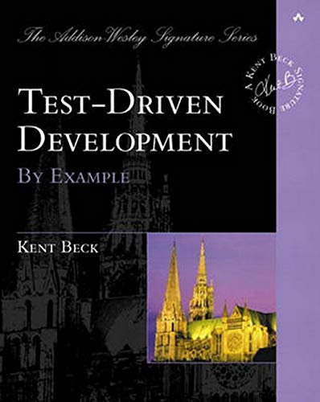
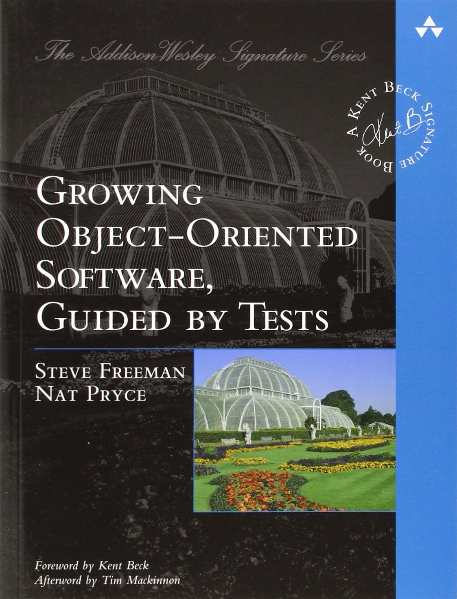

## Testing and TDD

notes on [this article](https://code.likeagirl.io/in-tests-we-trust-tdd-with-python-af69f47e6932)

- Unit tests are some pieces of code to exercise the input, the output and the behaviour of your code written anytime you want

- Test-Driven Development (TDD) is a strategy to think (and write!) tests first

- Take baby steps (in testing AND refactoring)

- The test name example: if our module is gender.py, our test name should be test_gender.py

- Separate from production code
```
mymodule/
 — module.py
 — another_folder/
 — — another_module.py
tests/
 — test_module.py
 — another_folder/
 — — test_another_module.py
 ```
 - Structure:
 ```
 Arrange, Act and Assert.

- Arrange: you need to organize the data needed to execute that piece of code (input)

- Act: here you will execute the code being tested (exercise the behaviour)

- Assert: after executing the code, you will check if the result (output) is the same as you were expecting
```
- pytest library is common platform

-The TDD cycle (from the article): 
```
🆘 Write a unit test and make it fail (it needs to fail because the feature isn’t there, right? If this test passes, call the Ghostbusters, really)

✅ Write the feature and make the test pass! (you can dance after that)

🔵 Refactor the code — the first version doesn’t need to be the beautiful one (don’t be shy)
```
!!! From the author about the design process:
```
One of the things that amaze me about TDD is how we can grow our software design consciously and well, just building what is needed to make the test pass. When we are writing tests we are forced to think about the design first and how we can break it into small pieces.
```
book recommendations:



