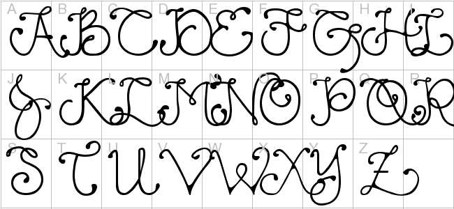

# Text
## Chapter 2 in Duckett html pp.40-61

Headings 1-6 are defined and have cascading defaults (can be overridden with CSS) `<h1>` - `<h6>`

`<p>` sets up paragraph

`<i> <b>` are italics and bold

`<sup> <sub>` are superscript and subscript

White spaces will be collapsed so use other methods (although acc Ryan: `<br> <hr>` frowned upon in industry)

Semantic markup: (many used and act as in research paper documentation)
+ `<strong>` shows bold (strong importance)
+ `<em>` shows italic (for emphasis)
+ `<blockquote>` shows indented l/r para
    ```
    <blockquote cite= (link)>
      <p> words words words<p>
    </blockquote>
    ```
+ `<q>` inline quote puts " around BUT most avoid using this

+ `<abbr>` hover for abbreviation/acronym spell out? Difference in HTML5: acronym not used
+ `<cite>` renders in italic
+ `<dfn>` indicates first instance of new term (Chrome and Safari do not change appearance, others possibly italics)
+ `<s>` strikethorough; no longer relevant but not deleted (as in price change)
+ `<ins> <del>` show document markup
    ```
    <p> it was the <del> best </del> <ins> worst </ins> of times
    ```
    renders: it was the ~~best~~ worst (underlined) of times


