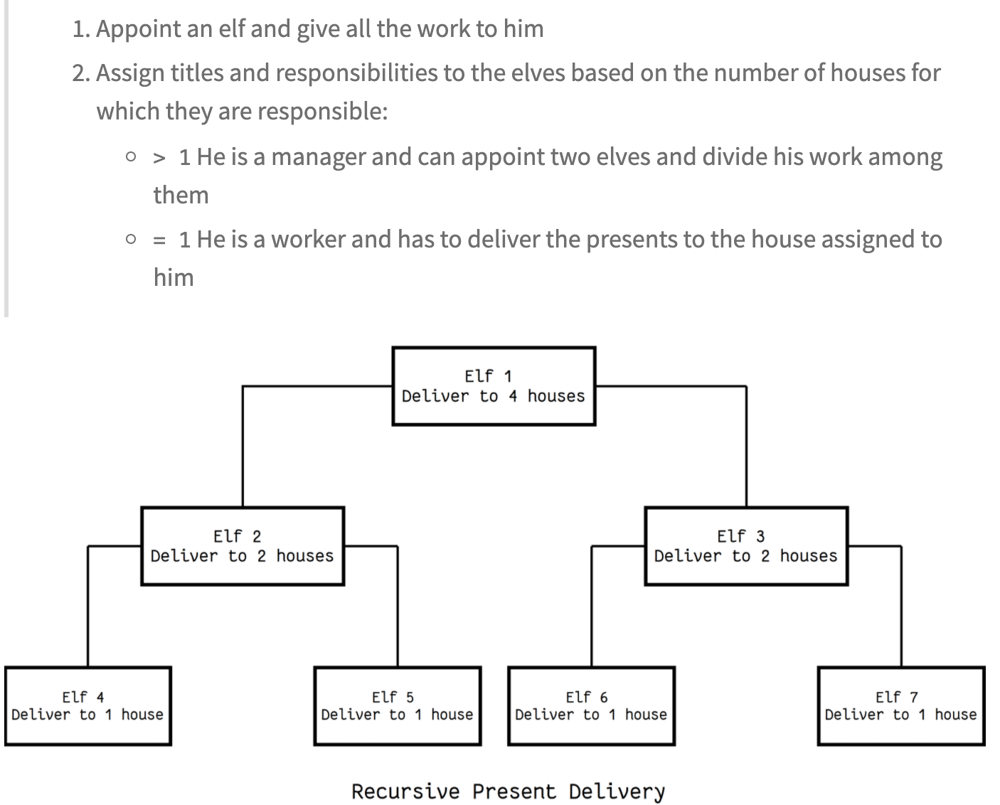
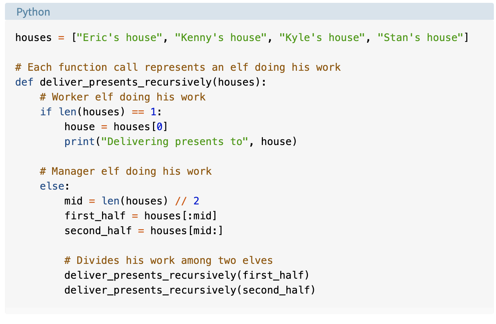
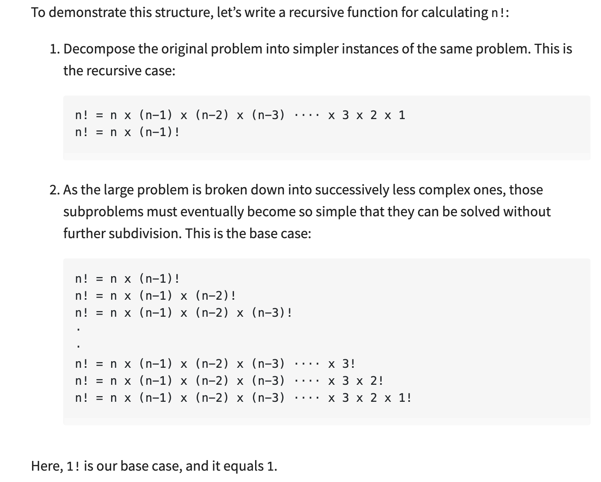

## Thinking Recursively
notes from [this article](https://realpython.com/python-thinking-recursively/)

Thinking Recursively involves breaking a problem down into small challenges that are easy to solve.

Things to think about: 

- mastering concepts such as recursive functions and recursive data structures
    
- maintaining state during recursion 
- avoiding recomputation by caching results 

A visual example:

Calculating factorials is the most straight-forward recursion:

Remember: recursion needs a base case

Remember: When dealing with recursive functions, keep in mind that each recursive call has its own execution context, so to maintain state during recursion you have to either:

- Thread the state through each recursive call so that the current state is part of the current call’s execution context
- Keep the state in global scope

Remember: A data structure is recursive if it can be defined in terms of a smaller version of itself.Other examples include set, tree, dictionary, etc.

Remember: using a cache or storing results in a data structure makes recursion not Naive. Code where you can look up and use what's been previously calculated  

Check out: [this article from Wikipedia on tail call(recursion)](https://en.wikipedia.org/wiki/Tail_call)

Python doesn’t have support for tail-call elimination. As a result, you can cause a stack overflow if you end up using more stack frames than the default call stack depth.

Remember: Also, Python’s mutable data structures don’t support structural sharing, so treating them like immutable data structures is going to negatively affect your space and GC (garbage collection) efficiency because you are going to end up unnecessarily copying a lot of mutable objects. 